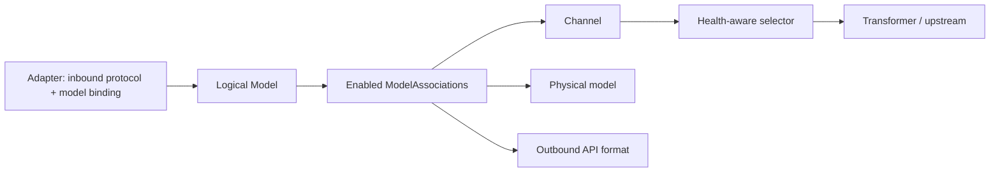
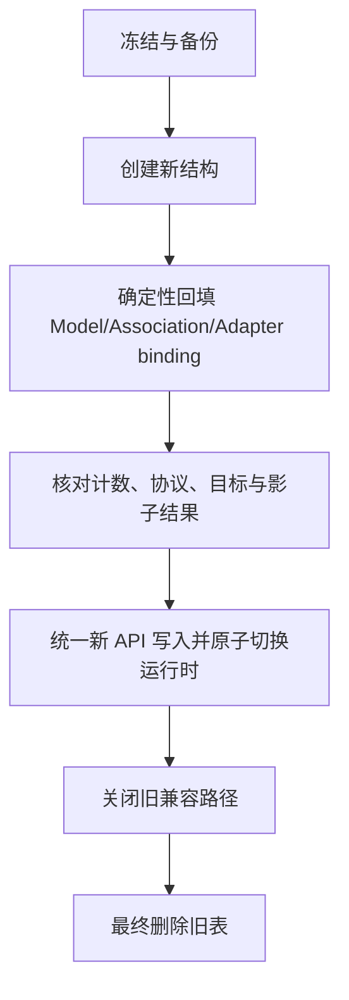

# 单实例适配器网关 - Model-centric 迁移计划

## Goal Capsule

- **目标**：将 AxonHub 收敛为单实例、单用户、按客户端 Adapter 接入的 AI 模型网关；Model 是唯一逻辑模型中心，消费端只依赖稳定的逻辑模型 ID。
- **最终链路**：`Adapter → logical Model → Associations → Channel + physical model`。
- **产品权威**：Adapter 固定入站协议并绑定 logical Model；Association 决定渠道、物理模型、出站协议、优先级、启用状态和能力；ModelGroup/ModelGroupProtocol/ModelGroupTarget 不属于最终领域模型。
- **迁移边界**：覆盖数据库契约、管理 API、运行时快照与候选选择、Adapter 路由、前端管理、旧 ModelGroup 清理及真实链路验收；不扩大到无关平台能力。

## Product Contract

### Summary

单实例后台维护逻辑 Model 及其 Associations。每个 Adapter 有唯一 inbound protocol，并绑定一个 logical Model。请求进入 Adapter 后，以逻辑模型查找启用 Associations，按 priority 和健康状态选择 Channel 与 physical model，使用 Association 的 outbound_api_format 调用上游，再将响应恢复为逻辑模型语义。

> **changed: ModelGroup 中心 → Model-centric — why**：用户明确纠正最终架构；ModelGroup 会制造第二个逻辑模型中心，重复领域语义并迫使 Adapter 绑定中间实体。ModelGroupTarget 仅作为一次性迁移来源，迁移完成后不参与运行时。

### MVP Boundary

- 保留已有渠道、协议转换、健康检查、重试和故障转移能力。
- Adapter 继续作为公开入口实例；Adapter 名称决定入口路径，单个 Adapter 只允许一个 inbound protocol。
- 消费入口一期读取但不校验 API Key；管理接口复用现有管理鉴权或本机约束。
- 业务配置继续以 Ent/SQLite 持久化，运行时通过快照原子刷新。
- 逻辑 Model、Association、Adapter binding 是新管理契约；ModelGroup GraphQL 不作为依赖契约。

### Key Technical Decisions

- **KTD-001（session-settled）**：Model 是唯一逻辑模型中心；ModelGroupTarget 只允许作为一次性迁移来源；Adapter 绑定 Model；迁移完成后最终删除旧 ModelGroup 相关表。
- **KTD-002（session-settled）**：Adapter 固定 inbound protocol；同一客户端可创建多个不同协议 Adapter，但一个入口不动态切换协议。
- **KTD-003（session-settled）**：Association 保存 outbound_api_format；出站协议不从 inbound protocol 隐式推断。
- **KTD-004（session-settled）**：候选目标按 priority 优先，并结合现有健康感知故障转移；不默认轮询。
- **KTD-005（session-settled）**：数据库是业务配置权威，运行时快照是请求读取权威。
- **KTD-006（planning recommendation）**：使用独立 `ModelAssociation` Ent 表，而非继续扩展 `ModelSettings.Associations` JSON。理由是路由契约需唯一约束、索引、审计、软删除、缓存失效和协议校验；保留 JSON 仅作为兼容读取/迁移输入，不作为新写入模型。

### Preservation Map

- 原有 R/A/F/AE 编号继续有效，含义不变；本次只将中心实体替换为 Model，并以 KTD-001 记录变更。
- 原有 ModelGroup 相关实现不删除其历史编号，但所有引用改为“迁移来源”或“待清理”，不得形成运行时回退。

## Planning Contract

- 每个实现单元必须先阅读列出的 repo-relative 文件，遵循现有 Ent、biz、GraphQL/REST、前端和缓存模式。
- 计划不提供可复制实现代码；feature-bearing unit 必须列出文件、模式、happy/edge/error/integration 场景及验证证据。
- 迁移不得丢失 inbound/outbound 协议信息：旧 ModelGroupProtocol 的协议维度必须逐条校验并拆分为 Adapter inbound protocol 与 Association outbound_api_format。
- 新旧结构不长期双写；仅在迁移窗口执行冻结备份、确定性回填、影子比对和原子切换。

## High-Level Technical Design

## Scope Boundaries

### In Scope

ModelAssociation 契约与 Ent 迁移；Model 管理 API；ModelGroup 数据回填；Adapter binding API/schema/snapshot；selector 候选链；`/models` 与 Adapter 前端；ModelGroup API/页面/路由/文案下线；测试、回滚和真实浏览器/HTTP 链路验收。

### Out of Scope

公网安全、消费 API Key 策略；与本迁移无关的 ModelCard 价格重构；Docker 个人代理配置；企业多租户、登录体系的进一步产品化。仅引用现有相关决策，不扩展这些范围。

## System-Wide Impact

- **持久化**：新增独立 Association 表、唯一约束、软删除/审计时间；Adapter binding 从 `model_group_id` 变为 `model_id`。
- **运行时**：`AdapterService.loadSnapshot/Refresh` 构建 Model-centric 图；selector 从 Model Associations 生成现有 `ChannelModelsCandidate`，复用后续 middleware/outbound transformer。
- **API**：管理 REST 的 Adapter binding 输入输出切换为 Model；Model API 增加 Association 管理；ModelGroup API 进入废弃再删除阶段。
- **前端**：Model association dialog 管理完整路由契约；Adapter 选择 Model；移除 ModelGroup 管理入口和文案。
- **运维**：迁移前备份，影子比对，原子刷新，旧表删除前保留可执行回滚窗口。

## Data and Protocol Contract

`ModelAssociation` 最小字段：logical model reference/model_id、channel_id、target_model_id、outbound_api_format、priority、enabled、capabilities、remark、soft-delete/audit timestamps。需建立 logical model/channel/physical model 存在性校验、唯一索引、优先级规则、缓存失效和协议兼容校验。

Adapter 保存唯一 inbound protocol 与 model binding。迁移旧 `ModelGroupProtocol` 时：每个协议实例必须映射到一个 Adapter inbound protocol；其目标池中的每个 `ModelGroupTarget` 拆成 Association，并保留 outbound format、channel、physical model、priority、enabled、capabilities。若同一旧目标被多个 inbound 协议共享，按协议语义生成独立 Association 或明确去重键；若协议字段缺失、冲突或无法无损拆分，阻断回填并生成核对报告，禁止猜测或静默丢弃。

## Implementation Units

### IU-1：ModelAssociation 契约、Ent 迁移与 Model API

- **Files**：`internal/ent/schema/model.go`；`internal/ent/schema/model_association.go`（新增）；`internal/server/biz/model*.go`；`internal/server/api/**` 中现有 Model 管理 handler；相关 GraphQL schema/resolver；生成文件按仓库生成流程更新。
- **Patterns**：沿用现有 Model、Channel service 的事务、权限、软删除、缓存失效和 DTO 校验模式；独立表承载可查询路由字段。
- **Happy path**：创建 logical Model；创建、排序、启用 Association；读取完整 association 列表；更新后刷新运行时。
- **Edge**：同一 logical model/channel/physical model/outbound format 的唯一冲突；priority 相同；禁用全部 Association；软删除后重新创建。
- **Error**：Model、Channel 或 physical model 不存在；outbound format 不被 Channel 支持；协议字段缺失；事务失败时不产生半套配置。
- **Integration**：管理 API 写入后 Model 快照可读取，候选结果只包含 enabled Associations。
- **Verification**：Ent schema/index 与迁移检查；API 契约测试；事务回滚、唯一约束、缓存失效测试；人工核对 generated diff。

### IU-2：现有 ModelGroup 数据确定性回填与核对

- **Files**：`internal/ent/schema/model_group*.go`；现有 ModelGroup/Adapter service 与迁移脚本所在目录；`internal/objects/**` 中 ModelGroup/ModelSettings 定义；迁移报告目录（如仓库已有约定）。
- **Patterns**：冻结备份 → 新结构 → 确定性回填 → 新旧影子比对；迁移脚本可重复、可审计、失败即阻断。
- **Happy path**：将当前有效配置回填为 logical model `gpt-5.6-luna`、Channel `cider-openai`、physical model `gpt-5.6-luna`、outbound `openai/responses`、priority 1、enabled，并将 `pi-openai-v2/DEFAULT` 绑定该 Model。
- **Edge**：多个协议、多个目标、重复目标、禁用目标、同名 logical/physical model、旧配置继承关系。
- **Error**：无法解析协议、目标或渠道；数量不匹配；回填后新旧候选集合不一致；任何信息丢失均阻断切换。
- **Integration**：冻结窗口影子运行旧/新 selector，比较 logical model、channel、physical model、protocol、priority、enabled 和能力集合。
- **Verification**：回填报告包含输入/输出计数、逐条映射、冲突和未处理项；备份可恢复演练；只有核对通过才允许进入下一单元。

### IU-3：Adapter binding API/schema/snapshot 切换为 Model

- **Files**：Adapter Ent schema、`internal/server/biz/adapter*.go`、现有 `/admin/gateway/adapters` handler/DTO、`internal/server/**` snapshot/refresh、相关 GraphQL/前端类型。
- **Patterns**：沿用 AdapterService `loadSnapshot/Refresh` 的原子替换和固定协议校验；输入字段从 `model_group_id` 改为 logical `model_id`。
- **Happy path**：创建/更新 Adapter 时绑定 Model 和唯一 inbound protocol；快照加载 Model Associations。
- **Edge**：Model 无 enabled Association；协议不匹配；更新绑定时并发刷新；删除 Model 被 Adapter 引用。
- **Error**：旧 model_group_id 被新 API 接收；快照构建失败时保留旧快照且返回可诊断错误；不得隐式回退 ModelGroup。
- **Integration**：管理写入、刷新、下一请求三步链路验证原子生效。
- **Verification**：API/schema 测试、快照原子替换测试、协议过滤测试、并发刷新失败保持旧快照测试。

### IU-4：Adapter selector 从 Model Associations 生成候选链

- **Files**：现有 `AdapterCandidateSelector`、selector middleware、`ChannelModelsCandidate`、outbound transformer 相关实现与测试。
- **Patterns**：复用既有 `ModelService.GetModelByModelID → EffectiveModelAssociations → ChannelModelsCandidate` 及健康感知选择，不引入 ModelGroup runtime 类型。
- **Happy path**：逻辑 Model 生成同样候选链，按 priority 选择健康 Channel 和 physical model，响应恢复逻辑 model。
- **Edge**：协议过滤、多个 Association、priority 并列、能力筛选、流式响应、工具调用、模型列表。
- **Error**：无候选、全部 unhealthy、转换器缺失、上游错误；错误语义保持现有链路约定。
- **Integration**：非流式/流式/工具调用/错误和故障转移通过真实 HTTP handler 验证。
- **Verification**：selector 单测对比影子结果；adapter selector test 覆盖协议、优先级、健康目标；禁止读取 ModelGroup runtime。

### IU-5：`/models` 与 Adapter 前端切换

- **Files**：`frontend/src/routes/**` 中 `/models` 与 Adapter 管理页面；`frontend/src/features/**` association dialog；GraphQL/query/mutation 类型；`frontend/src/locales/en.json`、`zh.json`。
- **Patterns**：沿用现有 Model 页面、权限、query invalidation 和 dialog 表单；字段使用英文代码标识符，用户文案保持中英文 i18n。
- **Happy path**：创建 logical Model、配置 Association、选择 Adapter binding Model/inbound protocol、刷新后看到状态。
- **Edge**：无 Association、禁用目标、协议不兼容、重复优先级、删除被引用 Model。
- **Error**：API 校验错误可定位到字段；刷新失败不误显示成功；旧 ModelGroup 链接不再出现。
- **Integration**：浏览器完成完整配置并调用 Adapter 页面/接口；query cache 在写入后失效。
- **Verification**：类型检查由现有 CI 负责；本任务只记录浏览器验收证据、网络响应和关键交互截图，不执行构建/lint/test/dev server。

### IU-6：ModelGroup 页面/API/路由/文案下线并最终删表

- **Files**：ModelGroup REST/GraphQL schema/resolver、`/admin/gateway/model-groups` 路由与 handler、前端 ModelGroup 页面/菜单/文案、旧 Ent schema 和迁移定义。
- **Patterns**：先关闭新写入和运行时读取，再删除管理入口，最后在回滚窗口结束后删除旧表；不得保留长期兼容回退。
- **Happy path**：旧 API 返回明确下线语义；新 Model API 成为唯一写入入口；最终移除旧表和无引用 schema。
- **Edge**：历史数据仍存在、外部脚本调用旧 API、旧 GraphQL resolver 未实现或 panic、部分部署尚未切换。
- **Error**：删除前检测旧引用和未完成迁移；发现引用则阻断删除并出具清单，不强删。
- **Integration**：旧路由关闭后新 Adapter 链路仍可用；数据库删除后启动、刷新和管理 API 不读取旧表。
- **Verification**：全仓引用搜索、路由 smoke、schema 迁移核对；确认无 ModelGroup runtime fallback；删除阶段具备回滚快照。

### IU-7：测试、回滚与浏览器/真实链路验收

- **Files**：`internal/server/**` 相关 adapter/model 测试；`integration_test/adapter/**`；前端现有 browser test 目录；迁移报告与回滚 runbook 所在 repo-relative 文档目录。
- **Patterns**：单元、集成、浏览器和真实 HTTP 分层；新旧影子比对只存在迁移窗口；回滚以备份和旧快照为边界。
- **Happy path**：Pi/Claude Code/Codex Adapter 真实协议请求成功，逻辑模型和流式事件正确。
- **Edge**：无 API Key 放行、工具调用、模型列表、优先级切换、健康目标恢复、并发刷新。
- **Error**：上游 4xx/5xx、协议转换错误、无候选、刷新失败、迁移冲突均有稳定错误语义。
- **Integration**：浏览器管理配置 → 真实 HTTP 调用 → 响应/日志/候选核对；覆盖迁移前后同请求结果影子比较。
- **Verification**：执行阶段按项目测试策略验证；本计划作者阶段仅执行 `git diff --check`，不运行 build/lint/test/dev server。

## Operational / Rollout Notes

1. 冻结 ModelGroup/Adapter 写入并制作可验证备份。
2. 部署新表和只读回填工具，确定性生成 Model/Association/Model binding。
3. 逐条核对协议和候选结果；失败即停止，不自动修复未知数据。
4. 切换新 API 写入和 Model-centric runtime snapshot，原子刷新后观察。
5. 关闭旧 API、旧 runtime 读取和旧前端入口；保留明确回滚窗口。
6. 回滚时恢复备份与旧快照，禁止新旧长期双写；窗口结束后删除旧表。

## Alternatives

- **继续 ModelGroup 作为中心**：拒绝。它重复 Model 的逻辑身份，Adapter 仍需经过中间实体，违背用户最终架构。
- **把 Association 继续放入 ModelSettings JSON**：不推荐。难以表达唯一约束、索引、审计、软删除和并发更新；仅可作为迁移输入或兼容读取。
- **让 Adapter 绑定具体 Channel/physical model**：拒绝。消费端和入口会感知供应商细节，无法复用逻辑模型及故障转移。
- **长期双写新旧模型**：拒绝。会产生漂移和不可审计的优先级/协议差异；仅保留迁移窗口影子比对。

## Risks / Dependencies

- 旧 ModelGroupProtocol 可能承载按 inbound protocol 分组的隐含语义，必须逐条拆分并验证。
- 现有 ModelSettings.Associations、Channel 模型映射和 EffectiveModelAssociations 的字段语义可能不完全一致，需要明确转换边界。
- Ent/GraphQL 生成物、缓存失效、路由注册和前端 query 类型必须同批切换。
- 外部脚本依赖旧管理 API 时，先提供下线告警/迁移说明，不保留运行时回退。

## Verification Contract

- **V-001**：`git diff --check` 无输出且退出成功。
- **V-002**：每个新 Association 的 logical model、channel、physical model、outbound protocol、priority、enabled、capabilities 可追溯。
- **V-003**：Adapter 只有固定 inbound protocol，绑定字段为 Model ID，运行时不读取 ModelGroup。
- **V-004**：新旧影子候选集合一致后才切换；所有不一致均阻断。
- **V-005**：管理端写入后原子刷新，下一请求使用新配置；刷新失败保留旧快照。
- **V-006**：真实非流式、流式、工具调用、错误、故障转移和模型列表链路通过。
- **V-007**：旧 API/路由/页面/文案和旧表在最终阶段删除，且无引用或回退。

## Definition of Done

- Model-centric Product Contract、KTD 和迁移阶段均已记录，旧 ModelGroup 中心决策明确标记 changed。
- ModelAssociation 契约、Adapter Model binding、selector、前端和旧表清理均有独立实现单元及验证场景。
- 有冻结备份、确定性回填、影子比对、原子切换和可执行回滚证据。
- 真实客户端可通过各 Adapter 调用；响应模型保持逻辑模型语义；优先级和健康故障转移生效。
- 新 API 成为唯一管理写入入口；ModelGroup 不再是运行时、管理契约或最终存储实体。
- 本计划文件仅包含 repo-relative 路径，无实现代码、命令编排、commit message 或文件外扩展范围。

## Deferred Items

- 消费 API Key 校验、全局/Adapter 级 token 策略。
- 多租户、用户和项目模型约束的进一步裁剪。
- 与本迁移无关的 ModelCard 价格/计费重构。
- 公网安全、Docker 个人代理配置及新的供应商能力模型。

## Plan Review State

- **状态**：implementation-ready。
- **交接确认项**：实现开始前确认迁移冻结窗口、备份保留时长、旧 API 下线公告窗口，以及真实 Pi/Claude Code/Codex 协议 fixture 的最终样例；这些确认不改变 Model-centric 架构或 KTD-001 至 KTD-005。
