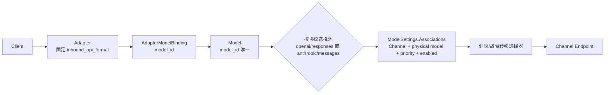
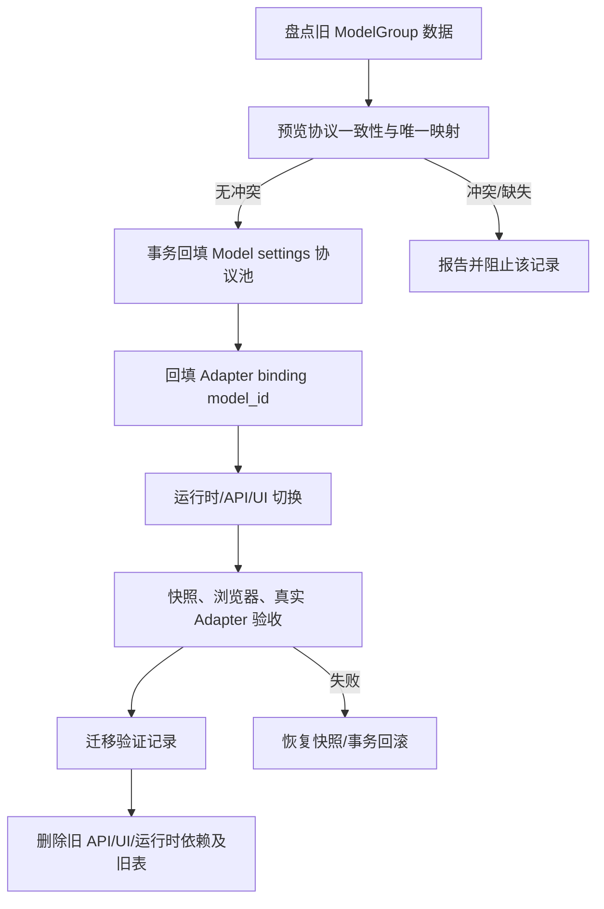

# 单实例适配器网关：Model-centric 迁移计划

## Goal Capsule

- **目标**：以现有 `Model` 为唯一逻辑模型中心，使多个不同入站协议的 Adapter 可以绑定同一个 Model，并按 Adapter 的固定协议选择 Model 内对应的协议池。
- **最终链路**：`Adapter → logical Model → inbound protocol pool → Channel + physical model`。
- **权威配置**：复用 `ModelSettings.Associations`；协议池 key 位于 associations 的顶层 map（规范化为 `protocolPools[<inbound_api_format>]`），池内目标保存既有 `channel_model`、priority、disabled/enabled 及匹配条件，不保存 outbound 字段。
- **迁移边界**：覆盖持久化契约、管理 API、运行时快照与选择器、Adapter 路由、前端 `/models`、旧 ModelGroup 下线、一次性数据迁移及真实链路验收。
- **Product Contract changed**：原计划以 ModelGroup 为中心，现按用户最终确认改为 Model + 协议池；因此旧 KTD-003/KTD-006 的 Association 出站字段及独立表建议均被替换。

## Product Contract

### 稳定契约

1. 同一个逻辑 Model 可绑定多个不同 inbound protocol 的 Adapter。
2. Adapter 只绑定 Model，不绑定 Channel、physical model 或 ModelGroup；Adapter 固定 `inbound_api_format`。
3. Model 按协议维护目标池。请求运行时用 Adapter 的 inbound protocol 选择同一 Model 的协议池；openai 入站只使用 openai 池，anthropic 入站只使用 anthropic 池，不做跨协议出站转换。
4. 协议池 key 决定该请求使用的协议；Adapter 的 inbound protocol 只选择同 key 的 Model pool，Channel endpoint 也必须使用该 pool protocol，不执行跨协议出站转换。池内 target 不填写 `outboundApiFormat`。Channel 只有在 `endpoints` 或 `defaultEndpoints` 明确包含池 key 时才可加入；历史目标不在列表时只能显示警告并进入迁移报告，不得自动改协议。
5. Model 内继续复用 `ModelSettings.Associations` 与已有 `ModelAssociation` matcher，不创建 Association 表或平行 Model 实体。
6. ModelGroup、ModelGroupProtocol、ModelGroupTarget 不再是领域、API 或运行时概念；旧表仅作一次性迁移来源，验证后物理删除，不双写、不 fallback。
7. 现有有效配置必须可确定性迁移：`gpt-5.6-luna` 的 `openai/responses` 池包含 `cider-openai` + `gpt-5.6-luna`、priority 1、enabled；`pi-openai-v2` 的 `DEFAULT` binding 指向该 Model。
8. 旧 `ModelGroupProtocol.inbound` 与 `ModelGroupTarget.outbound` 不一致时必须显式报告并阻止该记录迁移，禁止静默跨协议。

### Key Technical Decisions（session-settled）

- **KTD-001（session-settled，Product Contract changed）**：Model 是唯一逻辑模型中心；ModelGroupTarget 仅为一次性迁移来源，迁移验证后删除。
- **KTD-002（session-settled）**：Adapter 固定 inbound protocol；一个 Model 可被多个不同协议 Adapter 绑定。
- **KTD-003（session-settled，替换原决策）**：协议池 key 同时决定协议池语义及出站协议；association target 不存 `outboundApiFormat`，不做跨协议转换。
- **KTD-004（session-settled）**：候选按 priority 优先，保留现有 enabled、健康感知故障转移，不默认轮询。
- **KTD-005（session-settled）**：数据库配置是业务权威，运行时快照是请求读取权威；快照刷新需原子替换。
- **KTD-006（session-settled，替换原建议）**：复用 `ModelSettings.Associations` JSON 与既有 matcher；规范结构为顶层 `protocolPools` map，key 为 `inbound_api_format`（如 `openai/responses`），value 为目标数组/既有 association 字段。旧 settings 若仍是未分池数组，读取时视为 legacy pool 仅用于兼容读取，写入时一次性规范化并带 settings schema version；不得新增表或平行实体。

### ModelSettings 协议池兼容结构

- 新规范在现有 `ModelSettings` JSON 内增加 `schemaVersion` 与顶层 `protocolPools`：`protocolPools["openai/responses"] = {associations: [{channel_model: {channelId, modelId}, priority, disabled, ...既有匹配字段}]}`；协议池 key 是唯一协议来源，池内不出现 `outboundApiFormat`。
- 读取规则：新版本严格校验 key、目标结构和 endpoint 能力；旧 settings 的未分池 `Associations` 只按明确的 legacy 版本规则读取，不猜测协议、不自动复制到多个池。写入规则：保存前规范化为 `schemaVersion + protocolPools`，仅由用户/迁移明确指定池 key，读后写完成后禁止继续产生旧形态。
- 兼容失败返回可诊断错误并阻止快照刷新；旧目标的 Channel 若不在该池 key 对应的 `endpoints` 或 `defaultEndpoints` 中，只保留原值并发出警告/迁移报告，不自动改池或改协议。

### Adapter binding 约束

- `AdapterModelBinding` 只保存 `adapter_id`、`source_model_id`（实现层可映射为 `model_id`）及 binding 的来源/默认标识；同一 Adapter 内 `source_model_id` 必须唯一。
- 多个不同 `inbound_api_format` 的 Adapter 可以绑定同一 Model；binding 不含 channel、physical model、outbound 字段，多目标 priority 只存在 Model 的协议池中。

### Ent 与 endpoint 执行顺序

- 先保留 `internal/ent/schema/model_group.go`、`model_group_protocol.go`、`model_group_target.go` 及生成目录 `internal/ent/modelgroup/`、`modelgroupprotocol/`、`modelgrouptarget/`，确保迁移可读旧数据；先新增/修改 `internal/ent/schema/model.go`、`adapter_model_binding.go`，并更新对应生成 Ent 目录；由 `datamigrate/migrator.go` 与新增版本迁移文件提交确定性逐 Model 迁移和验证；只有全部前置验收通过，IU-06 才删除旧 schema、生成目录并提交删除版本迁移。
- 服务端唯一 endpoint 权威是 `internal/server/orchestrator/select_endpoints.go` 的协议解析/`endpoints` 与 `defaultEndpoints` 合并规则，以及 `internal/server/orchestrator/adapter_selector.go` 的候选校验。显式 `endpoints` 优先；显式字段缺失时使用 `defaultEndpoints`，二者都缺失视为不支持。Model API 保存、迁移写入和运行时选择必须调用这两处同一规则：只有合并结果明确包含协议池 key 才允许目标；历史不支持目标只警告/报告，不自动改协议。

## Planning Contract

- **R-001**：实现范围必须覆盖后端 schema/biz/API、迁移、运行时、前端配置和端到端验收。
- **R-002**：只修改既有 Model-centric 计划的内容，不把无关 ModelCard 价格、Docker 个人代理、消费 API key 纳入实施单元。
- **A-001**：以当前 `internal/ent/schema/model.go`、`internal/objects/model.go`、`internal/server/biz/model_association_matcher.go` 作为契约起点；具体字段名以实现时源码为准。
- **A-002**：渠道协议能力以已有 `endpoints`/`defaultEndpoints` 数据和校验逻辑为准，不维护第二套能力清单。
- **F-001**：迁移必须可预览、可检测冲突、事务化回滚，并在删除旧表前完成验证。
- **AE-001**：不得新增 Association 表、Adapter→Channel 直连、目标级 `outboundApiFormat` 或旧运行时 fallback。

## High-Level Technical Design

### 架构图

### 迁移阶段图

## Scope Boundaries

### In scope

- ModelSettings 的协议池表达、association 序列化校验、既有 matcher 的协议池选择。
- ModelGroup → Model 协议池及 Adapter binding 的确定性迁移、冲突报告、回滚。
- AdapterModelBinding 的 `model_id` 契约、快照、selector、priority/failover。
- `/models` 协议池配置、Channel endpoint 能力过滤、共享 Model 绑定。
- ModelGroup 的 REST/GraphQL/schema/UI/routes/运行时依赖下线和旧表最终删除。
- 后端、前端、浏览器及真实 Adapter 链路验证。

### Out of scope

- 新增供应商、协议转换策略、轮询策略或新的 Model 实体。
- ModelCard 价格、Docker 个人代理、消费 API key。
- 与本迁移无关的权限、计费、配额和渠道健康模型重构。

## System-Wide Impact

- **数据层**：Model `settings` 承载协议池；Adapter binding 从 `model_group_id` 改为 `model_id`，更新外键/唯一约束和迁移版本；旧 ModelGroup 表在验证后删除。
- **业务层**：matcher 输入协议池，selector 从 binding 取得 Model，再按固定协议取池；不存在池、池为空或无 enabled candidate 时返回可诊断错误。
- **API 层**：Model DTO/API 提供按协议池配置；Adapter DTO/API 接受 Model binding；删除 ModelGroup endpoint、resolver、输入输出类型。
- **前端**：`/models` 以协议池为编辑边界，依据 endpoints/defaultEndpoints 过滤 Channel；Adapter 绑定列表展示并选择共享 Model。
- **运行时**：快照结构和缓存 key 由 Model/协议池组成，刷新必须避免旧旧模型组数据进入请求路径。
- **运维/回滚**：迁移预览和冲突报告可审计；旧表删除前保留恢复点，运行时切换失败恢复旧快照和未删除的迁移事务。

## Alternatives

1. **保留 ModelGroup 作为中间层**：拒绝。会保留第二逻辑模型中心、阻碍多 Adapter 共享 Model，并违反最终契约。
2. **新增 ModelAssociation Ent 表**：拒绝。既有 JSON 与 matcher 已能表达目标池，新增表会产生平行权威和迁移复杂度。
3. **让 Adapter 绑定 Channel 或物理模型**：拒绝。会把协议路由和物理拓扑泄漏到入口，无法满足共享 Model 与协议池选择。
4. **协议不一致时自动转换或复制到另一池**：拒绝。必须报告/阻止，避免静默跨协议。

## Risks / Dependencies

- **RISK-001 数据冲突**：一个旧组含多个不一致协议 target；以预览报告阻止，事务不写入该记录。
- **RISK-002 多 binding 唯一约束**：同一 Adapter/Model/协议重复绑定；由 DTO 校验和数据库唯一约束共同拒绝。
- **RISK-003 JSON 兼容性**：旧 settings 读取失败会造成运行时空池；先做版本化解码/回写验证，再切换快照。
- **RISK-004 能力数据不完整**：Channel endpoint 字段缺失；沿用现有 defaultEndpoints 解析并在 UI/API 返回可诊断校验错误。
- **DEPENDENCY-001**：现有 ModelAssociation matcher、Channel endpoint 能力和健康故障转移实现必须可复用。
- **DEPENDENCY-002**：旧数据迁移需访问 ModelGroupProtocol/Target 与 Adapter binding 全量记录。

## Implementation Units

### IU-01：Model 协议池与既有 matcher 契约

- **文件 ownership**：owner 独占 `internal/objects/model.go`、`internal/ent/schema/model.go`、`internal/server/biz/model_association_matcher.go` 及 `internal/server/biz/model_association_matcher_test.go`；IU-02/IU-05 只读消费协议池类型。
- **现有模式**：复用 `ModelSettings.Associations`、`ModelAssociation` 的 `channel_model`、priority、disabled 和 `EffectiveModelAssociations` 继承逻辑。
- **实现要点**：增加协议池标识/结构并定义规范化、校验、空池行为；池 key 决定协议，target 不含 outbound 字段；matcher 接收协议池后保持既有优先级、enabled 与匹配条件。
- **场景**：happy：同一 Model 有 openai 与 anthropic 两池且各自匹配；edge：缺省池、空池、重复 target、禁用 target；error：未知协议或非法 Channel 能力；integration：继承 settings 后池选择仍确定。
- **验证**：`internal/objects/model_test.go`、`internal/server/biz/model_association_matcher_test.go` 覆盖版本化读写、旧 settings 兼容、协议隔离、priority 和 endpoint 拒绝；schema/API 校验拒绝非法池。

### IU-02：ModelGroup 一次性回填、冲突报告与回滚

- **文件 ownership**：IU-02 是旧数据 owner，独占 `internal/server/biz/model_group_migration.go`、`internal/server/biz/model_group_migration_test.go`、`internal/ent/schema/model_group.go`、`model_group_protocol.go`、`model_group_target.go` 及迁移服务；IU-06 不修改旧 schema/迁移，仅在 IU-02 完成交接后删除。
- **现有模式**：以旧 ModelGroupProtocol.inbound、ModelGroupTarget.channel/physical/outbound 和 Adapter binding 的 DEFAULT 记录为输入，写入既有 Model settings。
- **实现要点**：以一个 logical Model 为原子单元；先完整预览该 Model 下所有旧 ModelGroupProtocol、ModelGroupTarget 与 Adapter bindings，任一协议不一致、重复/歧义、缺 Model 或不可表达则整个 Model 不写入，其他 Model 可独立重试。幂等键为 `logical_model_id + legacy_model_group_id + inbound_api_format + channel_id + physical_model_id`；同键完全相同目标合并，priority/enabled 或物理目标不同时报告冲突并阻止。缺失 Model 仅在唯一 logical model 标识可确定创建时创建，否则阻止。报告包含 model、来源 ID、冲突类型、受影响记录、状态；成功 Model 重试跳过已成功幂等键，失败 Model 修复后从完整预览重新提交。
- **真实备份/恢复 artifact**：删表前导出带 schemaVersion 的 `model-centric-migration-backup.json`（或等价持久化 artifact），逐条包含旧 ModelGroup、ModelGroupProtocol、ModelGroupTarget、AdapterModelBinding 原始主键/外键/字段，以及迁移前 Model `settings`；同时保存校验 hash 和目标 Model 清单。备份校验成功后进入删表前窗口：冻结写入、切换只读快照，按“删除 API/运行时引用 → 删除 ModelGroupTarget → ModelGroupProtocol → ModelGroup → 生成代码/迁移完成”顺序执行。验证失败若仍在窗口内只执行同一事务回滚并恢复旧快照；一旦删表提交后不做模糊回滚，必须从 artifact 按原主键/外键顺序重建旧表数据，校验 hash 后恢复旧运行时。删表失败保留旧表、artifact 和旧快照，禁止切换新运行时。
- **场景**：happy：`gpt-5.6-luna` 正确回填 openai/responses target；edge：重复运行幂等、同池重复目标合并、已有 settings 合并；error：协议冲突、缺 Model/非唯一创建条件、endpoint 不支持、绑定歧义；integration：预览→事务→读回→回滚→重试。
- **验证**：`internal/server/biz/model_group_migration_test.go` 固定 fixture 断言按 Model 原子性、幂等重试、报告字段、artifact 全量字段/hash、删表顺序、窗口内事务回滚和删表后重建恢复；确认无静默跨协议改写。

### IU-03：Adapter binding 改为 model_id

- **文件 ownership**：owner 独占 `internal/ent/schema/adapter_model_binding.go`、`internal/server/biz/adapter_binding.go`、`internal/server/api/adapter_binding.go`、Adapter DTO/GraphQL schema/resolver 与 `internal/server/api/adapter_binding_test.go`；`gateway.go`、`adapter.go` 仅由 IU-06 owner 修改，IU-03 提供接口契约供其只读接入。
- **现有模式**：沿用现有 Adapter binding REST/DTO、DEFAULT 绑定语义和 Ent 外键迁移方式。
- **实现要点**：将 `model_group_id` 替换为 `source_model_id/model_id`，同一 Adapter 内唯一；多个不同 inbound protocol Adapter 可共享 Model。binding 不含 Channel、physical 或 outbound 字段，priority 只来自 Model 协议池。
- **场景**：happy：两个协议 Adapter 绑定同一 Model；edge：重复 source_model_id、重复 DEFAULT、不同协议合法共存；error：提交 ModelGroup ID、Channel/physical/outbound 字段或未知 Model；integration：迁移后的 `pi-openai-v2` binding 读回正确。
- **验证**：`internal/ent/schema/adapter_model_binding_test.go`、`internal/server/api/adapter_binding_test.go` 覆盖唯一约束、DTO 拒绝字段、共享 Model 和错误响应。

### IU-04：Adapter snapshot/selector 与 priority/failover

- **文件**：运行时 snapshot/selector、Adapter 请求路由、健康检查/故障转移相关 `internal/server` 与 `llm` 文件；对应测试。
- **现有模式**：复用现有快照原子刷新、ModelAssociation matcher、priority 排序、健康感知重试。
- **文件 ownership**：owner 独占真实运行时文件 `internal/server/orchestrator/adapter_selector.go`、`internal/server/orchestrator/select_endpoints.go` 与现有 `internal/server/biz/adapter.go` 的 snapshot 调用边界；IU-03/IU-06 只读调用 binding 接口，不创建不存在的 snapshot/selector 文件。
- **实现要点**：snapshot 从 binding 取 Model，使用 Adapter 固定 inbound protocol 选择同 key pool；Channel endpoint 使用该 pool protocol，仅在池内按 priority/enabled/健康状态 failover；移除 ModelGroup fallback，不做跨协议转换。
- **场景**：happy：openai Adapter 只走 openai pool；edge：最高 priority 不健康转下一个、池只有一个 target；error：无 binding、无池、全禁用、协议不匹配；integration：真实 Adapter 请求确认上游使用同一 pool protocol。
- **验证**：`internal/server/orchestrator/adapter_selector_test.go`、`internal/server/biz/adapter_snapshot_disabled_test.go`、对应 `llm/pipeline/*_test.go` 覆盖快照原子刷新、协议隔离和 failover；日志不出现 ModelGroup 查询。

### IU-05：`/models` 协议池配置与共享 Model UI

- **文件 ownership**：owner 独占 `frontend/src/routes/_authenticated/models/`、`frontend/src/features/models/`、`frontend/src/gql/models.ts` 及其现有测试；后端 Model API/GraphQL 由 IU-01 owner 修改，IU-05 只读消费其契约；不得修改 IU-03 的 Adapter API。
- **现有模式**：沿用现有 associations UI、GraphQL 数据层、表单校验和权限页面模式。
- **实现要点**：以协议池作为编辑边界；Channel 下拉按池协议过滤 `endpoints/defaultEndpoints`；保存池内 Channel/physical/priority/enabled，不提交 outbound 字段；Adapter 绑定选择已有 Model，支持多个不同协议 Adapter 共享。
- **场景**：happy：新增 openai/responses 池并选择 `cider-openai`；edge：渠道能力变化、空池、禁用 target、同 Model 多绑定、旧目标不在 endpoint 列表；error：提交不支持 endpoint 或 outbound/跨协议字段；integration：浏览器创建、保存、刷新后配置一致且旧目标只显示警告。
- **验证**：`frontend/src/features/models/model-pool-form.test.tsx`、`frontend/tests/models-model-pool.spec.ts` 覆盖过滤、警告、保存和共享 Model；API contract 证明只接受池内目标，浏览器验收证明旧 ModelGroup route 不可达。

### IU-06：ModelGroup 概念与旧表下线

- **文件 ownership**：IU-06 是下线 owner，独占 `internal/server/api/gateway.go`、`internal/server/biz/adapter.go` 中 ModelGroup 删除段、`frontend/src/routes/_authenticated/model-groups/`、`frontend/src/features/model-groups/`、`internal/ent/modelgroup/`、`internal/ent/modelgroupprotocol/`、`internal/ent/modelgrouptarget/` 及 `datamigrate/migrator.go` 中的删除版本迁移；IU-02 先交接旧数据 owner 后 IU-06 才可删除，IU-03/IU-05 对 gateway.go、adapter.go 只读。
- **现有模式**：按现有 endpoint、resolver、route 注册和 Ent schema 删除流程下线。
- **实现要点**：迁移验证后移除 ModelGroup REST/GraphQL/DTO/UI/routes、旧查询和缓存 key；删除 ModelGroupProtocol/Target 领域引用及旧表；不得保留双写或 fallback。
- **场景**：happy：全局搜索无生产引用且旧表删除成功；edge：历史数据已迁移、空旧表；error：仍有未迁移记录时阻止删表；integration：启动后的 API 路由不暴露 ModelGroup，Adapter 仍可用。
- **验证**：`internal/server/api/gateway_model_group_removal_test.go`、`internal/server/biz/model_group_removal_test.go` 加上 schema migration review；源码依赖扫描证明无生产引用，API 404/不注册验证，未迁移记录时删表被阻止。

### IU-07：全链路验收与回滚证明

- **文件 ownership**：owner 独占 `internal/server/integration/model_centric_adapter_test.go`、`frontend/tests/model-centric-adapter.spec.ts`、`internal/server/biz/fixtures/model_group_migration/` 与验收报告；各 IU owner 只提供契约/fixture，不改 IU-07 文件。
- **现有模式**：沿用项目既有后端测试、前端浏览器验收、Adapter 集成测试和快照验证方式。
- **实现要点**：覆盖协议隔离、共享 Model、优先级故障转移、endpoint 过滤、迁移报告、旧表删除前后回滚；不将无关功能纳入验收。
- **场景**：happy：openai 与 anthropic Adapter 分别命中各自同协议池；edge：同 Model 多 Adapter、目标健康变化、旧目标警告；error：协议冲突、空池、回滚触发、删表失败；integration：真实 Adapter 请求证明 inbound protocol 选择同协议 pool 且 Channel 使用该协议 endpoint。
- **验证**：`internal/server/integration/model_centric_adapter_test.go`、`frontend/tests/model-centric-adapter.spec.ts` 和迁移 fixture 产出请求日志、候选顺序、报告、回滚快照、route 结果；证据齐全后才允许删除旧表。

## Verification Contract

- **VC-001 数据契约**：Model `settings` 能保存并读回多个协议池；无 Association 表、无平行 Model。
- **VC-002 迁移契约**：有效配置精确回填；冲突显式报告并阻止；事务失败可回滚。
- **VC-003 路由契约**：Adapter 仅含 `model_id`；按固定 inbound protocol 选池；无 Adapter→Channel 直连。
- **VC-004 协议契约**：协议池决定出站协议；目标没有 `outboundApiFormat`；无跨协议转换。
- **VC-005 选择契约**：priority/enabled/健康故障转移行为保持并有测试证据。
- **VC-006 UI/API 契约**：Channel 按 endpoints/defaultEndpoints 过滤；Model 可被不同协议 Adapter 共享。
- **VC-007 下线契约**：ModelGroup API/UI/routes/运行时引用移除，旧表仅在验证后删除。

## Definition of Done

- 所有 KTD、R/A/F/AE 约束落入实现单元并有验证证据。
- `gpt-5.6-luna` 与 `pi-openai-v2` 有确定性迁移结果；协议冲突不会静默通过。
- ModelSettings/既有 matcher 承载协议池，未新增 Association 表或平行 Model。
- Adapter 不绑定 Channel，且目标配置不含 outboundApiFormat。
- openai/anthropic Adapter 只命中各自协议池，priority/failover、UI endpoint 过滤和真实链路通过。
- ModelGroup API/UI/运行时依赖清除，迁移验证后旧表删除；失败路径可回滚。
- 文档、测试和验收记录覆盖后端、前端、浏览器及真实 Adapter 链路。

## Deferred to Follow-Up Work

- 多租户、多用户权限模型、消费 API key 和配额计费。
- 新增协议或供应商、跨协议出站转换、动态协议协商。
- 独立路由策略编辑器、复杂权重/流量分配和健康模型重构。
- ModelCard 价格及其他产品目录能力、Docker 个人代理。
