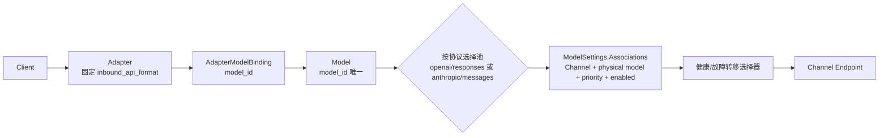
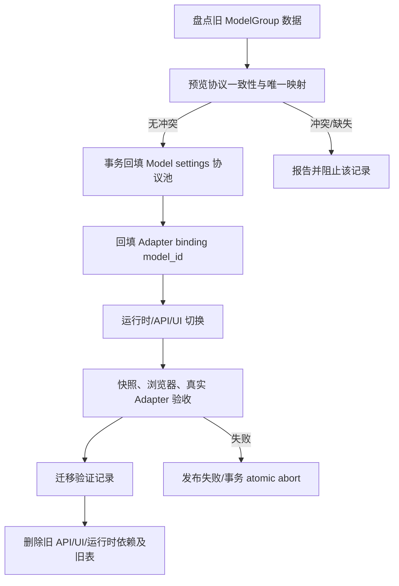

> 本计划已完成。架构和开发规范见 docs/architecture.md 和 docs/development-guide.md。

# 单实例适配器网关：Model-centric 迁移计划

## Goal Capsule

- **目标**：以现有 `Model` 为唯一逻辑模型中心，使多个不同入站协议的 Adapter 可以绑定同一个 Model，并按 Adapter 的固定协议选择 Model 内对应的协议池。
- **最终链路**：`Adapter → logical Model → inbound protocol pool → Channel + physical model`。
- **权威配置**：复用 `ModelSettings.Associations`；协议池 key 位于 associations 的顶层 map（规范化为 `protocolPools[<inbound_api_format>]`），池内目标保存既有 `channel_model`、priority、disabled/enabled 及匹配条件，不保存 outbound 字段。
- **迁移边界**：覆盖持久化契约、管理 API、运行时快照与选择器、Adapter 路由、前端 `/models`、旧 ModelGroup 下线、一次性数据迁移及真实链路验收。
- **Product Contract changed**：原计划以 ModelGroup 为中心，现按用户最终确认改为 Model + 协议池；因此旧 KTD-003/KTD-006 的 Association 出站字段及独立表建议均被替换。

## Product Contract

### 稳定契约

1. 同一个逻辑 Model 可绑定多个不同 inbound protocol 的 Adapter。
2. Adapter 只绑定 Model，不绑定 Channel、physical model 或 ModelGroup；Adapter 固定 `inbound_api_format`。
3. Model 按协议维护目标池。请求运行时用 Adapter 的 inbound protocol 选择同一 Model 的协议池；openai 入站只使用 openai 池，anthropic 入站只使用 anthropic 池，不做跨协议出站转换。
4. 协议池 key 决定该请求使用的协议；Adapter 的 inbound protocol 只选择同 key 的 Model pool，Channel endpoint 也必须使用该 pool protocol，不执行跨协议出站转换。池内 target 不填写 `outboundApiFormat`。Channel 只有在 `endpoints` 或 `defaultEndpoints` 明确包含池 key 时才可加入；历史目标不在列表时只能显示警告并进入迁移报告，不得自动改协议。
5. Model 内继续复用 `ModelSettings.Associations` 与已有 `ModelAssociation` matcher，不创建 Association 表或平行 Model 实体。
6. ModelGroup、ModelGroupProtocol、ModelGroupTarget 的产品、API、UI、路由和运行时引用本次一刀切移除；旧数据仅在一次性迁移入口读取，成功校验后删除，不双写、不保留旧链路兼容。
7. 现有有效配置必须可确定性迁移：`gpt-5.6-luna` 的 `openai/responses` 池包含 `cider-openai` + `gpt-5.6-luna`、priority 1、enabled；`pi-openai-v2` 的 `DEFAULT` binding 指向该 Model。
8. 旧 `ModelGroupProtocol.inbound` 与 `ModelGroupTarget.outbound` 不一致时必须显式报告并阻止该记录迁移，禁止静默跨协议。

### Key Technical Decisions（session-settled）

- **KTD-001（session-settled，Product Contract changed）**：Model 是唯一逻辑模型中心；ModelGroupTarget 仅为一次性迁移来源，迁移验证后删除。
- **KTD-002（session-settled）**：Adapter 固定 inbound protocol；一个 Model 可被多个不同协议 Adapter 绑定。
- **KTD-003（session-settled，替换原决策）**：协议池 key 同时决定协议池语义及出站协议；association target 不存 `outboundApiFormat`，不做跨协议转换。
- **KTD-004（session-settled）**：候选按 priority 优先，保留现有 enabled、健康感知故障转移，不默认轮询。
- **KTD-005（session-settled）**：数据库配置是业务权威，运行时快照是请求读取权威；快照刷新需原子替换。
- **KTD-006（session-settled，替换原建议）**：复用 `ModelSettings.Associations` JSON 与既有 matcher；规范结构为顶层 `protocolPools` map，key 为 `inbound_api_format`（如 `openai/responses`），value 为目标数组/既有 association 字段。旧 settings 仅在一次性迁移入口解析并规范化，迁移后禁止 legacy reader；不得新增表或平行实体。
- **KTD-007（session-settled，user-directed，一刀切）**：本次同时移除 ModelGroup、ModelGroupProtocol、ModelGroupTarget 的旧表、约束、索引、Ent schema、生成代码、迁移遗留、REST/API、UI、路由和运行时引用；一次性迁移成功后不保留历史兼容。

### ModelSettings 协议池兼容结构

- 新规范在现有 `ModelSettings` JSON 内增加 `schemaVersion` 与顶层 `protocolPools`：`protocolPools["openai/responses"] = {associations: [{channel_model: {channelId, modelId}, priority, disabled, ...既有匹配字段}]}`；协议池 key 是唯一协议来源，池内不出现 `outboundApiFormat`。
- 读取规则：新版本严格校验 key、目标结构和 endpoint 能力；旧 settings 的未分池 `Associations` 只按明确的 legacy 版本规则读取，不猜测协议、不自动复制到多个池。写入规则：保存前规范化为 `schemaVersion + protocolPools`，仅由用户/迁移明确指定池 key，读后写完成后禁止继续产生旧形态。
- 兼容失败返回可诊断错误并阻止快照刷新；旧目标的 Channel 若不在该池 key 对应的 `endpoints` 或 `defaultEndpoints` 中，只保留原值并发出警告/迁移报告，不自动改池或改协议。

### Adapter binding 约束

- `AdapterModelBinding` 只保存 `adapter_id`、`source_model_id`（实现层可映射为 `model_id`）及 binding 的来源/默认标识；同一 Adapter 内 `source_model_id` 必须唯一。
- 多个不同 `inbound_api_format` 的 Adapter 可以绑定同一 Model；binding 不含 channel、physical model、outbound 字段，多目标 priority 只存在 Model 的协议池中。

### Ent、endpoint 与阶段边界

- Ent 一次切换阶段先生成同时支持旧数据读取和新结构写入的迁移产物；由 `internal/ent/migrate/datamigrate/migrator.go` 在发布前完成 Model/settings/binding 回填与一致性校验，再执行删除旧表、约束、索引及旧 schema/生成引用的破坏性步骤；发布前不启动新运行时，迁移失败直接终止发布并由事务 atomic abort。
- 共享 endpoint protocol resolver/validator 的实际落点为新增 `internal/server/orchestrator/protocol_endpoint_validator.go` 及测试；它复用 `select_endpoints.go` 的协议解析和 `adapter_selector.go` 的候选语义。显式 `endpoints` 优先，只有显式字段缺失时 fallback `defaultEndpoints`；两者都不含协议则拒绝写入/候选。Model API 保存、ModelGroup→Model 迁移、运行时 selector 均调用该 validator，UI 只消费 API 返回的候选，不自行判定。

## Planning Contract

- **R-001**：实现范围必须覆盖后端 schema/biz/API、迁移、运行时、前端配置和端到端验收。
- **R-002**：只修改既有 Model-centric 计划的内容，不把无关 ModelCard 价格、Docker 个人代理、消费 API key 纳入实施单元。
- **A-001**：以当前 `internal/ent/schema/model.go`、`internal/objects/model.go`、`internal/server/biz/model_association_matcher.go` 作为契约起点；具体字段名以实现时源码为准。
- **A-002**：渠道协议能力以已有 `endpoints`/`defaultEndpoints` 数据和校验逻辑为准，不维护第二套能力清单。
- **F-001**：迁移必须可预览、可检测冲突并在单事务内 atomic abort；失败即发布失败且不产生半成品。
- **AE-001**：不得新增 Association 表、Adapter→Channel 直连、目标级 `outboundApiFormat` 或旧运行时兼容路径。

## High-Level Technical Design

### 架构图

### 迁移阶段图

## Scope Boundaries

### In scope

- ModelSettings 的协议池表达、association 序列化校验、既有 matcher 的协议池选择。
- ModelGroup → Model 协议池及 Adapter binding 的确定性迁移、冲突报告与原子中止证明。
- AdapterModelBinding 的 `model_id` 契约、快照、selector、priority/failover。
- `/models` 协议池配置、Channel endpoint 能力过滤、共享 Model 绑定。
- ModelGroup 的 REST/GraphQL/UI/routes/运行时依赖、旧 schema、生成代码、旧表、约束和索引在本次一刀切移除。
- 后端、前端、浏览器及真实 Adapter 链路验证。

### Out of scope

- 新增供应商、协议转换策略、轮询策略或新的 Model 实体。
- ModelCard 价格、Docker 个人代理、消费 API key。
- 与本迁移无关的权限、计费、配额和渠道健康模型重构。

## System-Wide Impact

- **数据层**：Model `settings` 承载协议池；Adapter binding 从 `model_group_id` 改为 `model_id`，更新外键/唯一约束和迁移版本；旧 ModelGroup 表在验证后删除。
- **业务层**：matcher 输入协议池，selector 从 binding 取得 Model，再按固定协议取池；不存在池、池为空或无 enabled candidate 时返回可诊断错误。
- **API 层**：Model DTO/API 提供按协议池配置；Adapter DTO/API 接受 Model binding；删除 ModelGroup endpoint、resolver、输入输出类型。
- **前端**：`/models` 以协议池为编辑边界，依据 endpoints/defaultEndpoints 过滤 Channel；Adapter 绑定列表展示并选择共享 Model。
- **运行时**：快照结构和缓存 key 由 Model/协议池组成，刷新必须避免旧旧模型组数据进入请求路径。
- **发布/失败边界**：代码发布先完成迁移入口和新结构产物；迁移事务完成并校验通过后才启动新运行时并执行旧表删除。任一失败直接终止发布并 atomic abort，不产生半成品。

## Alternatives

1. **保留 ModelGroup 作为中间层**：拒绝。会保留第二逻辑模型中心、阻碍多 Adapter 共享 Model，并违反最终契约。
2. **新增 ModelAssociation Ent 表**：拒绝。既有 JSON 与 matcher 已能表达目标池，新增表会产生平行权威和迁移复杂度。
3. **让 Adapter 绑定 Channel 或物理模型**：拒绝。会把协议路由和物理拓扑泄漏到入口，无法满足共享 Model 与协议池选择。
4. **协议不一致时自动转换或复制到另一池**：拒绝。必须报告/阻止，避免静默跨协议。

## Risks / Dependencies

- **RISK-001 数据冲突**：一个旧组含多个不一致协议 target；以预览报告阻止，事务不写入该记录。
- **RISK-002 多 binding 唯一约束**：同一 Adapter/Model/协议重复绑定；由 DTO 校验和数据库唯一约束共同拒绝。
- **RISK-003 JSON 兼容性**：旧 settings 读取失败会造成运行时空池；先做版本化解码/回写验证，再切换快照。
- **RISK-004 能力数据不完整**：Channel endpoint 字段缺失；沿用现有 defaultEndpoints 解析并在 UI/API 返回可诊断校验错误。
- **DEPENDENCY-001**：现有 ModelAssociation matcher、Channel endpoint 能力和健康故障转移实现必须可复用。
- **DEPENDENCY-002**：旧数据迁移需访问 ModelGroupProtocol/Target 与 Adapter binding 全量记录。

## 运行时清理与发布边界

- 清理 `internal/server/biz/adapter.go`、`internal/server/orchestrator/adapter_selector.go`、`internal/server/orchestrator/select_endpoints.go`、缓存/候选路径、API DTO 及 `frontend/src/lib/adapterApi.ts` 中的 `model_group_id`、`ModelGroup*`、目标 `outboundApiFormat` 和 ModelGroup 兼容路径；新 selector 只从 binding 的 model_id 选同 inbound pool。
- 发布 gate 严格顺序为：一次性迁移事务读取旧表并写入 Model protocolPools/Associations 与 Adapter bindings → 读回一致性校验 → DDL 删除旧表/约束/索引及旧 schema/生成引用 → 启动新 runtime。不得声称代码发布、DB transaction、DDL 和 runtime 启动全局原子；任一步失败即发布失败，不启动新 runtime，不产生半成品。`endpoints/defaultEndpoints` 仍按 Channel 正常能力解析。

## Implementation Units

### 执行 DAG 与交接门槛

`IU-01 → IU-02 → IU-03 → IU-04 → IU-05 → IU-06 → IU-07`。IU-02 唯一拥有 `internal/ent/migrate/datamigrate/migrator.go`，负责逐 logical Model 的一次性读取、回填、冲突报告和一致性校验；其验收门槛是源数据与目标 settings/bindings 读回一致且单事务 atomic abort 可验证。只有 IU-02 交接通过，IU-06 才能禁用旧 ModelGroup API/UI/路由/运行时读写并执行旧结构删除；IU-06 随后删除旧 schema/生成代码/表，二者不重叠。
### IU-01：Model 协议池与既有 matcher 契约

- **文件 ownership**：owner 独占 `internal/objects/model.go`、`internal/ent/schema/model.go`、`internal/server/biz/model_association_matcher.go` 及 `internal/server/biz/model_association_matcher_test.go`；IU-02/IU-05 只读消费协议池类型。
- **现有模式**：复用 `ModelSettings.Associations`、`ModelAssociation` 的 `channel_model`、priority、disabled 和 `EffectiveModelAssociations` 继承逻辑。
- **实现要点**：增加协议池标识/结构并定义规范化、校验、空池行为；池 key 决定协议，target 不含 outbound 字段；matcher 接收协议池后保持既有优先级、enabled 与匹配条件。
- **场景**：happy：同一 Model 有 openai 与 anthropic 两池且各自匹配；edge：缺省池、空池、重复 target、禁用 target；error：未知协议或非法 Channel 能力；integration：继承 settings 后池选择仍确定。
- **验证**：`internal/objects/model_test.go`、`internal/server/biz/model_association_matcher_test.go` 覆盖版本化读写、旧 settings 兼容、协议隔离、priority 和 endpoint 拒绝；schema/API 校验拒绝非法池。
- **完成状态**：✅ 已完成（U1）。对应提交：基线 `a4d8f10f`（U1 已完成并作为本次集成基线）。

### IU-02：ModelGroup 一次性回填、冲突报告与事务 atomic abort

- **文件 ownership**：IU-02 是旧数据 owner，独占 `internal/server/biz/model_group_migration.go`、`internal/server/biz/model_group_migration_test.go`、`internal/ent/schema/model_group.go`、`model_group_protocol.go`、`model_group_target.go` 及迁移服务；IU-06 不修改旧 schema/迁移，仅在 IU-02 完成交接后删除。
- **现有模式**：以旧 ModelGroupProtocol.inbound、ModelGroupTarget.channel/physical/outbound 和 Adapter binding 的 DEFAULT 记录为输入，写入既有 Model settings。
- **实现要点**：以一个 logical Model 为原子单元；先完整预览该 Model 下所有旧 ModelGroupProtocol、ModelGroupTarget 与 Adapter bindings，任一协议不一致、重复/歧义、缺 Model 或不可表达则整个 Model 不写入，其他 Model 可独立重试。幂等键为 `logical_model_id + legacy_model_group_id + inbound_api_format + channel_id + physical_model_id`；同键完全相同目标合并，priority/enabled 或物理目标不同时报告冲突并阻止。缺失 Model 仅在唯一 logical model 标识可确定创建时创建，否则阻止。报告包含 model、来源 ID、冲突类型、受影响记录、状态；成功 Model 重试跳过已成功幂等键，失败 Model 修复后从完整预览重新提交。
- **迁移与幂等**：本次不保留旧运行链路、legacy reader 或双写。以 `logical_model_id + legacy_model_group_id + inbound_api_format + channel_id + physical_model_id` 为确定性幂等键；在单事务中以源数据和目标 settings/bindings 读回校验判定重复执行，事务 abort 后重新从旧数据重试，禁止产生半成品。IU-02 只负责读取/回填/校验，IU-06 接收成功报告后负责删除旧 schema、生成引用和表。
- **场景**：happy：`gpt-5.6-luna` 正确回填 openai/responses target；edge：重复运行幂等、同池重复目标合并、已有 settings 合并；error：协议冲突、缺 Model/非唯一创建条件、endpoint 不支持、绑定歧义；integration：预览→事务→读回→失败中止→重试。
- **验证**：`internal/server/biz/model_group_migration_test.go` 固定 fixture 断言按 Model 原子性、幂等重试、报告字段、artifact 全量字段/hash、删表顺序及失败边界内事务 atomic abort；确认无静默跨协议改写且失败不产生半成品。
- **完成状态**：✅ 已完成（U2）。对应提交范围：`9ac04fbd..221caa71`（含 `873743e8..f6339e46` 的跨方言、SQLite fixture 与事务边界修复），迁移 gate 后续修复见 U7。

### IU-03：Adapter binding 改为 model_id

- **文件 ownership**：owner 独占 `internal/ent/schema/adapter_model_binding.go`、`internal/server/biz/adapter_binding.go`、`internal/server/api/adapter_binding.go`、Adapter DTO/GraphQL schema/resolver 与 `internal/server/api/adapter_binding_test.go`；`gateway.go`、`adapter.go` 仅由 IU-06 owner 修改，IU-03 提供接口契约供其只读接入。
- **现有模式**：沿用现有 Adapter binding REST/DTO、DEFAULT 绑定语义和 Ent 外键迁移方式。
- **实现要点**：将 `model_group_id` 替换为 `source_model_id/model_id`，同一 Adapter 内唯一；多个不同 inbound protocol Adapter 可共享 Model。binding 不含 Channel、physical 或 outbound 字段，priority 只来自 Model 协议池。
- **场景**：happy：两个协议 Adapter 绑定同一 Model；edge：重复 source_model_id、重复 DEFAULT、不同协议合法共存；error：提交 ModelGroup ID、Channel/physical/outbound 字段或未知 Model；integration：迁移后的 `pi-openai-v2` binding 读回正确。
- **验证**：`internal/ent/schema/adapter_model_binding_test.go`、`internal/server/api/adapter_binding_test.go` 覆盖唯一约束、DTO 拒绝字段、共享 Model 和错误响应。
- **完成状态**：✅ 已完成（U3）。对应提交范围：`bb223ae5..8f968152`；后续 binding GID/字段回归修复纳入 U7。

### IU-04：Adapter snapshot/selector 与 priority/failover

- **文件**：运行时 snapshot/selector、Adapter 请求路由、健康检查/故障转移相关 `internal/server` 与 `llm` 文件；对应测试。
- **现有模式**：复用现有快照原子刷新、ModelAssociation matcher、priority 排序、健康感知重试。
- **文件 ownership**：owner 独占真实运行时文件 `internal/server/orchestrator/adapter_selector.go`、`internal/server/orchestrator/select_endpoints.go` 与现有 `internal/server/biz/adapter.go` 的 snapshot 调用边界；IU-03/IU-06 只读调用 binding 接口，不创建不存在的 snapshot/selector 文件。
- **实现要点**：snapshot 从 binding 取 Model，使用 Adapter 固定 inbound protocol 选择同 key pool；Channel endpoint 使用该 pool protocol，仅在池内按 priority/enabled/健康状态 failover；移除 ModelGroup 兼容路径，不做跨协议转换。
- **场景**：happy：openai Adapter 只走 openai pool；edge：最高 priority 不健康转下一个、池只有一个 target；error：无 binding、无池、全禁用、协议不匹配；integration：真实 Adapter 请求确认上游使用同一 pool protocol。
- **验证**：`internal/server/orchestrator/adapter_selector_test.go`、`internal/server/biz/adapter_snapshot_disabled_test.go`、对应 `llm/pipeline/*_test.go` 覆盖快照原子刷新、协议隔离和 failover；日志不出现 ModelGroup 查询。
- **完成状态**：✅ 已完成（U4）。对应提交范围：`d8d98763..c85af528`；协议隔离与 selector 类型边界修复见 U7。

### IU-05：`/models` 协议池配置与共享 Model UI

- **文件 ownership**：owner 独占 `frontend/src/routes/_authenticated/models/`、`frontend/src/features/models/`、`frontend/src/gql/models.ts` 及其现有测试；后端 Model API/GraphQL 由 IU-01 owner 修改，IU-05 只读消费其契约；不得修改 IU-03 的 Adapter API。
- **现有模式**：沿用现有 associations UI、GraphQL 数据层、表单校验和权限页面模式。
- **实现要点**：以协议池作为编辑边界；Channel 下拉按池协议过滤 `endpoints/defaultEndpoints`；保存池内 Channel/physical/priority/enabled，不提交 outbound 字段；Adapter 绑定选择已有 Model，支持多个不同协议 Adapter 共享。
- **场景**：happy：新增 openai/responses 池并选择 `cider-openai`；edge：渠道能力变化、空池、禁用 target、同 Model 多绑定、旧目标不在 endpoint 列表；error：提交不支持 endpoint 或 outbound/跨协议字段；integration：浏览器创建、保存、刷新后配置一致且旧目标只显示警告。
- **验证**：`frontend/src/features/models/model-pool-form.test.tsx`、`frontend/tests/models-model-pool.spec.ts` 覆盖过滤、警告、保存和共享 Model；API contract 证明只接受池内目标，浏览器验收证明旧 ModelGroup route 不可达。
- **完成状态**：✅ 已完成（U5）。对应提交范围：`5d0e253d..af15f75d`；Channel 过滤、Relay GID、模型初始化循环等前端回归修复见 U7。

### IU-06：ModelGroup 产品、运行时与旧持久化结构一刀切移除

- **文件 ownership**：IU-06 是删除 owner，独占 `internal/server/api/gateway.go`、`internal/server/biz/adapter.go` 中 ModelGroup 删除段、`frontend/src/routes/_authenticated/model-groups/`、`frontend/src/features/model-groups/`、`internal/ent/schema/model_group.go`、`model_group_protocol.go`、`model_group_target.go`、对应 `internal/ent/modelgroup/`、`modelgroupprotocol/`、`modelgrouptarget/` 及删除 migration；IU-02 唯一拥有 `internal/ent/migrate/datamigrate/migrator.go` 的旧数据读取/回填，完成一致性报告后串行交接，二者不重叠。
- **现有模式**：按现有 endpoint、resolver、route 注册和 Ent schema 删除流程下线。
- **实现要点**：消费 IU-02 成功报告后移除 ModelGroup REST/GraphQL/DTO/UI/routes、新配置入口和运行时读写；随后删除旧表、约束、索引、旧 schema、生成代码和迁移遗留；不保留双写、legacy reader 或旧链路兼容。
- **场景**：happy：全局搜索无产品/运行时引用且旧表仍可读；edge：历史数据已迁移、旧表为空；error：迁移未完成时阻止运行时切换；integration：启动后的 API 路由不暴露 ModelGroup，Adapter 仍可用。
- **验证**：`internal/server/api/gateway_model_group_removal_test.go`、`internal/server/biz/model_group_removal_test.go`、Ent 删除迁移验证；确认旧表不存在、旧 schema/生成引用不存在、ModelGroup API 404/不注册。
- **完成状态**：✅ 已完成（U6）。对应提交范围：`09c94038..3a173920`（产品面/运行时移除、旧表清理与删除 gate）。

### IU-07：全链路验收与发布失败边界及原子中止证明

- **文件 ownership**：owner 独占 `internal/server/integration/model_centric_adapter_test.go`、`frontend/tests/model-centric-adapter.spec.ts`、`internal/server/biz/fixtures/model_group_migration/` 与验收报告；各 IU owner 只提供契约/fixture，不改 IU-07 文件。
- **现有模式**：沿用项目既有后端测试、前端浏览器验收、Adapter 集成测试和快照验证方式。
- **实现要点**：覆盖协议隔离、共享 Model、优先级故障转移、endpoint 过滤、迁移报告、旧表删除前后的发布失败边界与原子中止；不将无关功能纳入验收。
- **场景**：happy：openai 与 anthropic Adapter 分别命中各自同协议池；edge：同 Model 多 Adapter、目标健康变化、旧目标警告；error：协议冲突、空池、事务 atomic abort、删表失败；integration：真实 Adapter 请求证明 inbound protocol 选择同协议 pool 且 Channel 使用该协议 endpoint。
- **验证**：`internal/server/integration/model_centric_adapter_test.go`、`frontend/tests/model-centric-adapter.spec.ts` 和迁移 fixture 产出请求日志、候选顺序、报告、发布失败边界与原子中止证据、route 结果；证据齐全后才允许启动新运行时并执行旧表删除。
- **完成状态**：✅ 已完成（U7）。对应提交范围：`ca8417a5..d603b134`，含 `f8793d24`/`d0fed1b7`（AdapterRefreshResult）、`b717fd09`/`7257a672`（APIFormat）、`a649ae29`（migration gate）、`af15f75d..d603b134`（前端与运行时回归修复）。

## 集成验收结果

- ✅ Go 定向测试通过。
- ✅ 前端 typecheck：无本次新增回归；保留 175 条既有 TypeScript 错误。
- ✅ SQLite 迁移 gate 通过；迁移由 beta7 + drop gate 自动执行。
- ✅ curl E2E 通过。
- ✅ 浏览器 E2E 通过。
- ✅ 协议隔离通过：Adapter 固定 inbound protocol，只命中同 key 协议池。

> 提交范围按主要归属标注；跨 Unit 的修复提交在对应 Unit 和 U7 中交叉注明。

## 已知限制

- PostgreSQL 未实连验证。
- MySQL 按设计 fail-fast，未作为兼容运行路径验证。
- 前端仍有 175 条既有 TypeScript 错误，确认非本次引入。
- general settings/retry policy 仍可能出现 `no user in context` 告警；该告警不在 Adapter 请求路径内。

## 一刀切发布 Gate 与失败边界

同一部署 gate 按以下顺序执行：发布迁移入口在数据库事务内一次性读取旧 ModelGroup 数据，写入 Model 的 `protocolPools`/`ModelSettings.Associations` 与 Adapter `model_id` bindings，并完成一致性校验；校验通过后执行旧表/约束/索引及旧 Ent schema/生成引用的删除，再启动新运行时。旧数据读取仅存在于发布迁移入口，运行时和新 API 不读取旧表。若项目迁移工具不能把 DDL 纳入同一事务，则 DDL 删除必须紧随数据事务并作为同一部署 gate；任一步骤失败均 atomic abort、发布失败且不启动新运行时，不产生半成品。

## 数据映射与唯一协议池技术契约

- `ModelGroup.name` 规范化后作为 `Model.model_id`：trim、大小写保持、空值拒绝；同名旧组归入同一 logical Model。Model 缺失时仅在 name 唯一且通过 Model 校验时创建；已有 settings 必须按协议池合并，冲突不覆盖。重复 target 以 `logical_model + pool_key + channel_id + physical_model_id` 判定；字段完全一致合并，priority/enabled 或物理目标不同则按 logical Model 原子阻止。旧组协议与 target 协议不一致、多个组映射歧义、不可表达或 endpoint 不支持，均阻止整个 Model 写入；报告包含 model、来源组/协议/target ID、冲突类型、记录和状态。
- `ModelSettings` 唯一形态为 `{schemaVersion, protocolPools: {<inbound_api_format>: {targets: [{channel_model, priority, disabled, ...既有匹配字段}]}}}`。pool key 是唯一协议和出站协议来源；developer inheritance 先按现有 `EffectiveModelAssociations` 规则展开，再按 pool key 合并；priority 升序、disabled 等价于 disabled/enabled 既有语义；同 pool 重复键仅允许完全一致项合并，其他情况拒绝。迁移入口将旧 settings 一次性规范化，运行时/API 不读取旧形态；继续复用 `ModelAssociation` matcher，不新增表。

## 前端与错误状态验收

- `/models` 使用 `frontend/src/routes/_authenticated/models/`、`frontend/src/features/models/**` 编辑协议池；Adapter 绑定独立使用 `frontend/src/routes/_authenticated/adapters/`、`frontend/src/features/adapters/**`、`frontend/src/lib/adapterApi.ts`。sidebar、route-permission 同步移除 ModelGroup 导航/权限/路由；Channel 下拉仅消费服务端 resolver 过滤结果，同一 Model 可绑定多个不同协议 Adapter。
- 浏览器验收覆盖 401（未登录）、403（无权限）、404（Model/route 不存在）、409（协议/重复 target/冲突）、5xx（迁移或保存失败）的稳定错误状态；OpenAI Adapter 只能命中 openai pool，Anthropic Adapter 只能命中 anthropic pool。

> 测试路径若当前不存在，实施单元必须创建；计划不假定未存在的测试文件已提供。

## Verification Contract

- **VC-001 数据契约**：Model `settings` 能保存并读回多个协议池；无 Association 表、无平行 Model。
- **VC-002 迁移契约**：有效配置精确回填；冲突显式报告并阻止；事务失败 atomic abort 且不产生半成品。
- **VC-003 路由契约**：Adapter 仅含 `model_id`；按固定 inbound protocol 选池；无 Adapter→Channel 直连。
- **VC-004 协议契约**：协议池决定出站协议；目标没有 `outboundApiFormat`；无跨协议转换。
- **VC-005 选择契约**：priority/enabled/健康故障转移行为保持并有测试证据。
- **VC-006 UI/API 契约**：Channel 按 endpoints/defaultEndpoints 过滤；Model 可被不同协议 Adapter 共享。
- **VC-007 下线契约**：确认旧表不存在、旧 schema/生成引用不存在、ModelGroup API 404/不注册；无 legacy reader、旧链路兼容或双写。

## Definition of Done

- 所有 KTD、R/A/F/AE 约束落入实现单元并有验证证据。
- `gpt-5.6-luna` 与 `pi-openai-v2` 有确定性迁移结果；协议冲突不会静默通过。
- ModelSettings/既有 matcher 承载协议池，未新增 Association 表或平行 Model。
- Adapter 不绑定 Channel，且目标配置不含 outboundApiFormat。
- openai/anthropic Adapter 只命中各自协议池，priority/failover、UI endpoint 过滤和真实链路通过。
- ModelGroup API/UI/运行时依赖、旧 schema、生成代码和旧表/约束/索引全部移除；迁移失败事务 atomic abort，不产生半成品。
- 文档、测试和验收记录覆盖后端、前端、浏览器及真实 Adapter 链路。

## Deferred to Follow-Up Work

- 多租户、多用户权限模型、消费 API key 和配额计费。
- 新增协议或供应商、跨协议出站转换、动态协议协商。
- 独立路由策略编辑器、复杂权重/流量分配和健康模型重构。
- ModelCard 价格及其他产品目录能力、Docker 个人代理。
