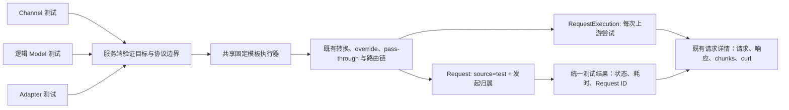

# 统一测试追踪 - Plan

## Goal Capsule

- **Objective:** 让平台管理员能从 Channel、逻辑 Model 或 Adapter 发起固定模板的连通性测试，并在一次跳转内查看本次测试真实发往上游的请求、响应和 curl。
- **Product authority:** 本计划只覆盖测试入口、目标选择和测试执行记录的可见性；不改变生产请求的路由、协议池、渠道 override 或参数透传规则。
- **Open blockers:** 无。请求或响应体被全局存储策略关闭时，产品须提示记录不可用，而不是把缺失内容解释为测试失败或参数未生效。

---

## Product Contract

### Summary

测试入口覆盖 Channel、逻辑 Model 和 Adapter 三个配置面。
每次运行使用固定安全模板，并把“本次测试”直接关联到已脱敏的真实上游执行记录，使管理员能验证渠道注入或覆盖的参数是否实际到达 Provider。

### Problem Frame

现有 Channel 测试主要在当前弹窗中显示成功或失败；完整测试记录虽可在测试历史和请求详情中查看，但入口与本次结果脱节。
逻辑 Model 缺少测试入口，Adapter 的前端直连测试也未被明确标记为测试或按 Adapter 归属，导致管理员无法一致地验证协议选择、模型映射和参数透传。

### Actors

- A1. **平台管理员：** 配置渠道、逻辑 Model 与 Adapter，并在变更后验证可用性和真实上游载荷。

### Key Decisions

- KTD1. **三个配置面共享同一测试追踪结果。** Channel、逻辑 Model 与 Adapter 的测试都必须落到可查看的单次测试记录，而不是只返回瞬时成功/失败。 (session-settled: user-directed — chosen over 仅优先改造 Channel：用户明确选择三个页面一起覆盖)
- KTD2. **测试请求使用固定安全模板。** 不提供 prompt、JSON 或模型专有参数的人工编辑；验证对象是已保存的渠道与模型配置。 (session-settled: user-directed — chosen over 可编辑测试请求：用户选择只展示 curl 和响应)
- KTD3. **以真实上游执行记录作为参数透传证据。** UI 必须区分网关收到的测试模板与 Provider 实际收到的出站载荷；不新建与请求详情重复的测试日志体系。 (session-settled: user-directed — chosen over 重构独立 TestOrchestrator：现有执行记录已保存经转换、透传和 override 后的上游请求)
- KTD4. **协议边界不可隐式跨越。** 逻辑 Model 测试只能选择该协议池内可用目标；Channel 和 Adapter 测试只能选择其实际支持的协议格式与绑定，不允许为测试静默跨协议兜底。 (Governs R1-R3)

### Requirements

**目标选择与执行**

- R1. 从 Channel 发起测试时，管理员可选择该 Channel 已配置且实际可用的协议格式与物理模型组合；无可用组合时，界面说明原因且不发送请求。 (Governed by KTD4)
- R2. 从逻辑 Model 发起测试时，管理员可选择一个协议池及其可用目标；目标必须显示 Channel 与物理模型，且不会跨协议池回退。 (Governed by KTD4)
- R3. 从 Adapter 发起测试时，管理员可针对一个 Adapter 及其有效绑定执行测试；测试必须走该 Adapter 的入站协议和源模型映射，不得改由其他 Adapter 承接。 (Governed by KTD4)
- R4. 三类测试均使用相同的固定、安全、低成本请求模板，并保留当前渠道对流式测试的既有要求。

**本次测试与追踪证据**

- R5. 测试结果必须展示状态、耗时和“查看本次执行”动作；该动作直接打开本次测试的记录，不能要求管理员在通用历史中猜测或筛选对应请求。
- R6. 本次记录必须同时区分并展示：网关接收的测试请求，以及每个上游执行尝试实际发送的协议格式、脱敏 headers、URL、请求体、响应体或错误、状态码和流式 chunks。
- R7. 上游执行记录必须提供可复制的脱敏 curl；curl 与请求体都以实际发给 Provider 的最终载荷为准，因此可用于核对渠道 override、pass-through 和模型专有参数是否生效。
- R8. 发生重试或故障切换时，本次记录必须保留全部上游执行尝试，并让管理员能分别查看每一次的请求、响应和错误。
- R9. 所有由此功能产生的记录均标记为测试来源，并能从发起它的 Channel、逻辑 Model 或 Adapter 上下文回看；不得与普通调用记录混淆。
- R10. 若请求体或响应体因全局存储策略未保存，结果和详情必须明确说明缺失原因；不得把空 body 呈现为参数未透传或 Provider 空响应。

### Key Flows

- F1. **测试 Channel**
  - **Trigger:** A1 在 Channel 操作中选择测试。
  - **Steps:** 选择可用协议格式和物理模型；运行固定模板；查看状态后打开本次执行记录。
  - **Outcome:** A1 可查看该 Channel 实际发给 Provider 的载荷与响应。 (Covers R1, R4-R8)
- F2. **测试逻辑 Model**
  - **Trigger:** A1 在逻辑 Model 操作中选择测试。
  - **Steps:** 选择协议池和可用目标；运行固定模板；打开本次执行记录。
  - **Outcome:** A1 能证明逻辑 Model 在指定协议池没有跨协议回退，并由选定目标执行。 (Covers R2, R4-R8)
- F3. **测试 Adapter**
  - **Trigger:** A1 对具体 Adapter 绑定选择测试。
  - **Steps:** 选择有效入站协议与源模型映射；运行固定模板；打开本次执行记录。
  - **Outcome:** A1 能确认请求经指定 Adapter 进入并映射到预期目标。 (Covers R3-R9)

### Acceptance Examples

- AE1. **验证 DeepSeek 关闭思考参数**
  - **Given:** 某 Channel 已保存关闭思考的渠道参数，且请求体存储开启。
  - **When:** A1 选择该 Channel 的对应协议格式和物理模型完成测试，并打开本次执行。
  - **Then:** 出站请求体中可见最终生效的关闭思考参数；A1 不需要从入站固定模板推断参数是否透传。 (Covers R1, R5-R7)
- AE2. **逻辑 Model 禁止跨协议兜底**
  - **Given:** 逻辑 Model 的 OpenAI 与 Anthropic 协议池有不同可用目标。
  - **When:** A1 选择其中一个协议池测试。
  - **Then:** 只展示并调用该协议池的可用目标；没有可用目标时测试被阻止并说明原因。 (Covers R2)
- AE3. **存储策略关闭时的可解释结果**
  - **Given:** 系统关闭请求体或响应体存储。
  - **When:** A1 完成任一类型测试并打开详情。
  - **Then:** 状态与错误仍可查看，缺失的原始内容显示为由存储策略关闭导致。 (Covers R10)

### Scope Boundaries

- **In scope:** 三个配置面的一致测试入口、受约束的目标选择、本次测试直达执行记录、测试来源标识和已有请求详情的复用。
- **Deferred for later:** 自定义 prompt、自由 JSON 编辑器、批量按逻辑 Model 或 Adapter 测试、测试结果趋势报表与告警。
- **Outside this product's identity:** 修改生产路由、协议池配置、Channel override/pass-through 行为，或为测试另建独立日志存储与详情页。

### Dependencies / Assumptions

- 测试操作者拥有当前请求历史和请求详情所需的管理权限。
- 系统的请求体与响应体存储策略决定原始内容能否在测试后查看。
- 逻辑 Model 的可用目标由既有协议池与 Channel 绑定规则决定；本功能只呈现和验证这些规则，不改变规则。

### Success Criteria

- 管理员从任一测试完成状态可在一次动作内打开本次真实上游执行记录。
- 管理员能通过出站请求体而非入站模板，判断模型专有参数是否生效。
- 测试来源、执行尝试和缺失原始内容的原因均可解释，不与普通调用记录混淆。

### Sources / Research

- `internal/server/orchestrator/tester.go` — Channel 测试使用现有 ChatCompletionOrchestrator。
- `internal/server/orchestrator/orchestrator.go` — 常规请求链持久化 Request 与 RequestExecution。
- `internal/ent/schema/request_execution.go` — 执行记录的上游请求、响应、URL 和脱敏 headers 语义。
- `frontend/src/features/channels/components/channels-test-history-drawer.tsx` — Channel 测试历史、curl 与请求详情入口。
- `frontend/src/features/requests/components/request-detail-content.tsx` — 执行级请求、响应、chunks 与 curl 展示。

---

## Planning Contract

### Product Contract Preservation

Product Contract unchanged. 本次深化只补充实现路径、验证和边界；R1-R10、F1-F3、AE1-AE3 与 KTD1-KTD4 的产品语义保持不变。

### Key Technical Decisions

- KTD5. **测试追踪以主请求为稳定定位符。** 共享测试执行器只在既有 pipeline 已创建 Request 后返回该 Request 的 Relay ID；前置目标拒绝返回无 ID 的可解释结果，已创建请求的上游失败可定位，成功与重试共享同一主 Request。Request 的执行连接继续承载重试和故障切换产生的所有 RequestExecution，满足 KTD1、KTD3 与 R5-R8。
- KTD6. **测试归属写入既有 Request。** 复用既有不可变 `source=test` 标识测试来源，仅新增可筛选的 Channel、Model、Adapter 发起归属类型与稳定标识。该归属字段为 nullable，历史测试记录保持当前行为且不会伪造归属；新记录可在三个配置面独立回看。此为现有可观测记录的轻量归因字段，不新增测试日志实体，满足 KTD1、KTD3 与 R9。
- KTD7. **服务端是测试目标的唯一裁决者。** 前端仅提交用户选择；后端根据已保存 Channel 能力、Model 协议池或当前 Adapter runtime snapshot 验证并构造唯一目标。无效、禁用或跨协议的组合在执行前拒绝，不以备用协议或备用 Adapter 补偿，满足 KTD4 与 R1-R3。
- KTD8. **Adapter 测试复用运行时路由语义。** 将当前浏览器直接 fetch 改为受管理的测试调用，使用 Adapter 的实际入站格式、源模型绑定和 runtime snapshot 进入同一转换与候选选择链。它返回统一追踪结果而非瞬时浏览器响应，满足 KTD1、KTD3、KTD4 与 R3-R9。
- KTD9. **内容可用性由存储策略显式解释。** 请求详情根据服务端提供的请求体、响应体与 chunks 存储状态渲染“未保存”的原因；实际空对象、失败信息和未保存不能互相推断，满足 R6、R7 与 R10。

### High-Level Technical Design

### Integration Boundaries

- **测试模板与执行：** 扩展现有 Channel 测试执行器，固定模板、流式要求、转换、override、pass-through、重试与持久化仍通过现有 orchestrator pipeline；前置拒绝不创建记录，已创建记录的成功和失败均返回主 Request 定位符；不通过测试路径改变生产请求行为。
- **目标解析：** Channel 的完整协议格式、Model 的协议池关联、Adapter 的入站格式和 runtime binding 分别由现有能力与路由规则验证。所有客户端提交的 ID、格式和模型仅作候选输入，不能绕开服务端校验。
- **记录与详情：** Request 保存测试来源、发起归属和网关入站模板；RequestExecution 已保存最终上游 URL、脱敏 headers、请求体、响应体、错误、状态码和 chunks。详情页继续由执行记录生成 curl，不创建第二个 curl 或日志模型。
- **授权：** 新 mutation 与管理端测试入口沿用当前 Channel、Model、Adapter 管理权限和 Request 查询授权；缺少请求详情授权时不得把受保护的记录内容通过测试结果泄露。

### Research Basis

- 已验证 `ChatCompletionOrchestrator.Process` 会在现有 pipeline 中依次持久化 Request 与最终出站 RequestExecution，且执行记录位于 override、pass-through 后，可证明最终上游载荷。
- 已验证 `AdapterCandidateSelector` 按 Adapter 入站格式归一化至协议池，现有规则禁止跨池选择；前端 Model 的 `channelSupportsProtocolPool` 只适用于显示层，服务端仍须裁决。
- 已验证 Channel 测试历史和请求详情已有 `source=test` 过滤、Request ID 路由、执行详情和实际执行 curl；Adapter 当前仅在浏览器中直接请求并返回瞬时结果。
- 外部研究未执行：本任务不引入新的外部依赖或公开平台契约，本地代码和项目规则已提供可执行模式。

### Deferred Implementation Notes

- 现有存储策略只能从 body 为空推断“可能未保存”。实现时应选择与系统设置一致、且不向无权用户暴露全局设置细节的内容可用性契约；若当前 Request GraphQL 形状不足，补充只读状态字段而非由前端猜测。
- 发起归属使用 nullable、可索引且可由 Ent/GraphQL 过滤的最小标量字段。实现需验证现有数据库升级和备份恢复保留新字段；历史无归属记录不回填、不伪造归属；不得手改生成的 Ent 或 gqlgen 文件。

---

## Implementation Units

### U1. 建立最小测试归属与三态追踪基础

- **Goal:** 在复用既有 `source=test`、Request 与 RequestExecution 生命周期的前提下，为新测试持久化最小发起归属，并只为已创建 Request 的执行返回稳定定位符。
- **Requirements:** R5, R8, R9 (governed by KTD1, KTD3); KTD5, KTD6.
- **Dependencies:** None.
- **Files:** `internal/contexts/source.go`, `internal/ent/schema/request.go`, `internal/server/biz/request.go`, `internal/server/orchestrator/orchestrator.go`, `internal/server/backup/restore.go`, `internal/server/backup/backup_test.go`, `internal/contexts/context_test.go`, `internal/server/orchestrator/orchestrator_basic_test.go`.
- **Approach:** 保留现有 `WithSource` 与 `source=test`，不再创建第二套来源抽象，也不复用 trace ID 作为发起配置面的归属。仅增加用于服务端筛选的 nullable、可索引发起类型和发起标识字段；借助独立上下文值将其传至现有 Request 创建路径。历史无归属记录不回填：它们保留原有 source 行为，不出现在 Model/Adapter 的归属历史中。扩展现有 orchestrator 返回值和测试执行器，明确三态：前置拒绝不创建 Request 且无详情 ID；已创建 Request 的上游失败返回该 ID；成功及重试共享同一主 Request ID。先更新 Ent 源 schema 并生成 Ent 产物，再更新备份恢复映射和测试；禁止手改生成代码。
- **Test scenarios:**
  - Channel 测试成功后返回的主请求 ID 对应既有 `source=test` 和新增的 Channel 发起归属。
  - 已创建请求的上游失败仍返回同一主请求 ID，且执行记录保存失败状态和错误。
  - 一次发生重试或切换的测试只返回一个主请求 ID，并在其执行连接中保留全部尝试。
  - 无目标、禁用目标或其他前置拒绝不创建 Request，也不返回虚假的详情链接。
  - 既有 API、Playground 和历史测试记录不获得伪造归属；备份恢复后保留新字段。
- **Verification:** 持久化层、备份恢复和 orchestrator 测试共同证明来源复用、归属筛选和三态追踪；生成后的 Ent 产物只由 schema 变更产生，测试执行器对该结果的映射由 U2 验证。

### U2. 实现统一、协议受限的测试目标解析与执行

- **Goal:** 将 Channel、逻辑 Model 和 Adapter 的用户选择解析为受当前配置约束的唯一测试目标，并以同一固定模板运行既有处理链。
- **Requirements:** R1, R2, R3, R4 (governed by KTD4); AE1, AE2; KTD7, KTD8.
- **Dependencies:** U1.
- **Files:** `internal/server/orchestrator/tester.go`, `internal/server/orchestrator/candidates.go`, `internal/server/orchestrator/adapter_selector.go`, `internal/server/biz/model.go`, `internal/server/biz/adapter.go`, `internal/server/orchestrator/tester_test.go`, `internal/server/orchestrator/adapter_selector_test.go`, `internal/server/orchestrator/outbound_test.go`, `internal/server/orchestrator/pass_through_test.go`.
- **Approach:** 将现有 Channel 测试执行器扩展为三个入口共享的受控执行路径。Channel 组合须同时满足配置的完整 endpoint 格式和物理模型；逻辑 Model 只从选定 protocol pool 的有效关联解析 Channel 与物理模型；Adapter 在服务端读取当前 runtime snapshot、验证指定启用 binding，并用该 Adapter 的入站格式、源模型映射和既有 AdapterCandidateSelector 进入同一转换与候选选择链。固定模板继续尊重目标要求的 stream 策略。此单元只消费内部输入和返回内部执行结果，不声明 GraphQL operation；所有选择在执行前由服务端复核，禁止从不同协议池、其他 Adapter 或未启用目标补偿。
- **Test scenarios:**
  - Channel 只列出并执行同时具备所选完整格式和物理模型的组合。
  - 逻辑 Model 的 OpenAI 测试不能选择或调用 Anthropic pool 的目标，反向亦然。
  - 空协议池、禁用 Channel、失效 endpoint 或不可解析关联被拒绝且不创建请求。
  - Adapter 测试只接受当前 snapshot 中启用的 binding，并使用其入站格式和源模型映射。
  - 固定模板经过渠道 transform、override 或 pass-through 后，执行记录保存最终出站 body；其中可断言模型专有设置的生效结果。
  - 渠道要求流式时，固定测试保留既有流式行为并完成记录持久化。
- **Verification:** 后端拒绝所有无效或跨协议选择；三个有效入口均复用同一 pipeline，并在执行记录中显示预期协议、Channel 与物理模型。

### U3. 独占维护 GraphQL 测试与详情数据契约

- **Goal:** 作为唯一的 GraphQL 契约 owner，为前端提供可显示的测试目标、统一执行结果、测试归属筛选和内容可用性状态，同时保持请求详情的安全边界。
- **Requirements:** R1-R10 (governed by KTD1, KTD3, KTD4); KTD5-KTD9.
- **Dependencies:** U1, U2.
- **Files:** `internal/server/gql/llm-proxy.graphql`, `internal/server/gql/model.graphql`, `internal/server/gql/axonhub.resolvers.go`, `internal/server/gql/model.resolvers.go`, `internal/server/gql/gqlgen.yml`, `internal/server/gql/axonhub_resolvers_test.go`, `frontend/src/features/channels/data/channels.ts`, `frontend/src/features/models/data/models.ts`, `frontend/src/features/requests/data/requests.ts`, `frontend/src/features/requests/data/schema.ts`.
- **Approach:** 此单元独占共享 GraphQL schema、resolver 与 gqlgen 映射：先更新源 schema 与映射，运行仓库的代码生成，再只在生成要求的位置实现 resolver，最后同步全部前端 operation、list/detail/filter 查询。定义只读目标发现契约与三个入口共享的结果字段。结果显式表达 U1 的三态，只有已创建 Request 的结果含定位符。目标发现返回协议、Channel、物理模型、binding 状态和不可测原因；执行输入只接受该契约允许的目标。请求查询提供归属过滤和 body/chunks 内容可用性状态，遵循现有 Request 查询授权，不返回未授权记录的内容或敏感 headers。
- **Test scenarios:**
  - Channel、Model 与 Adapter 的发现数据不包含禁用、跨协议或不属于当前 runtime snapshot 的目标。
  - 对伪造、过期或不匹配的发现结果发起执行时，服务端拒绝且不落库。
  - 成功、可追踪失败与前置拒绝分别返回正确的统一结果状态和可选 Request 定位字段。
  - Request 查询能按测试归属过滤，普通测试历史不会混入不同发起配置面的记录。
  - 不具备请求详情权限的调用不能经测试 payload 或查询读取请求体、响应体、headers 或 curl 所需数据。
- **Verification:** 通过 schema、代码生成、resolver 和 TypeScript operation 的完整链路验证契约；U1/U2 不再修改 GraphQL 文件，前端只使用服务端返回的目标和追踪定位符。

### U6. 提供详情可解释性与共享归属历史组件

- **Goal:** 让已有请求详情解释内容缺失，并提供可被三个配置面复用的按归属测试历史与详情跳转组件。
- **Requirements:** R5-R10 (governed by KTD1, KTD3); AE3; KTD6, KTD9.
- **Dependencies:** U3.
- **Files:** `frontend/src/features/requests/components/request-detail-content.tsx`, `frontend/src/features/requests/components/curl-preview-dialog.tsx`, `frontend/src/features/requests/components/test-origin-history-drawer.tsx`, `frontend/src/features/requests/data/test-origin-history.test.mjs`, `frontend/src/features/channels/components/channels-test-history-drawer.tsx`, `frontend/src/locales/en/requests.json`, `frontend/src/locales/zh-CN/requests.json`.
- **Approach:** 以 Request 为详情入口、以 RequestExecution 为逐次尝试证据，补齐请求体、响应体和 chunks 的“策略未保存”提示；不将 JSON 空对象或缺少 chunks 直接解释为 Provider 行为。新增共享的归属历史抽屉，接收由各配置面提供的归属条件，复用 U3 的服务端过滤和现有全局请求详情跳转；Channel 的既有历史抽屉改为该组件的 Channel 包装。此组件是三个明确消费者共享的唯一历史实现，继续使用现有 execution curl 生成器及脱敏 headers，不复制 curl 生成逻辑。
- **Test scenarios:**
  - 请求详情对存储策略关闭的请求体、响应体和 chunks 显示可解释提示，同时仍显示状态码、错误和可用元数据。
  - 对真实空响应与未保存响应分别渲染，二者不共享误导性文案。
  - 归属历史只显示对应 Channel、Model 或 Adapter 发起的 `source=test` 请求；历史无归属记录遵循既有 Channel 历史兼容行为。
  - 重试或故障切换的详情列出每个执行尝试，各自的 URL、格式、脱敏 headers、body、response/error 和 curl 保持独立。
- **Verification:** 组件级测试覆盖内容可用性和归属过滤；共享抽屉能由三个配置面打开记录并一次进入对应详情。

### U4. 升级 Channel 与逻辑 Model 的测试交互

- **Goal:** 让管理员在 Channel 和逻辑 Model 页面先选择符合协议边界的目标，再在结果处直接查看本次执行或打开该配置面的归属历史。
- **Requirements:** R1, R2, R4-R9 (governed by KTD1, KTD2, KTD4); F1, F2; AE1, AE2.
- **Dependencies:** U3, U6.
- **Files:** `frontend/src/features/channels/components/channels-test-dialog.tsx`, `frontend/src/features/channels/components/channels-columns.tsx`, `frontend/src/features/channels/data/channel-capability.test.mjs`, `frontend/src/features/models/components/data-table-row-actions.tsx`, `frontend/src/features/models/components/models-dialogs.tsx`, `frontend/src/features/models/components/models-test-dialog.tsx`, `frontend/src/features/models/context/models-context.tsx`, `frontend/src/features/models/data/protocol-pools.test.mjs`, `frontend/src/locales/en/channels.json`, `frontend/src/locales/zh-CN/channels.json`, `frontend/src/locales/en/models.json`, `frontend/src/locales/zh-CN/models.json`.
- **Approach:** 使用 U3 提供的 data hooks，将 Channel 测试列表的单位从仅模型名称扩展为后端认可的协议/物理模型目标；每一个已执行项独立显示状态、耗时、错误和“查看本次执行”。保留当前 Channel 批量选择能力时，每一项必须保有自己的追踪链接，不得把多次执行合并为一个模糊结果。为逻辑 Model 增加测试操作与弹窗，先选 protocol pool，再选该池内的 Channel 与物理模型；使用现有 Relay GID 约定保存 Select 值，不以裸数字转换 ID。两个入口同时接入 U6 的归属历史抽屉；不提供可编辑 prompt 或 JSON。
- **Test scenarios:**
  - Channel 弹窗不展示不支持所选协议的 endpoint/模型组合，并在没有可选项时给出阻止原因。
  - 每个 Channel 测试结果都能从弹窗一次打开对应全局请求详情；一个失败不覆盖同批其他结果的链接。
  - Model 弹窗切换协议池时立即清除不属于该池的选择和旧结果。
  - Model 没有可用目标时禁用执行并展示服务端理由，而不是前端回退至另一协议。
  - Channel 与 Model 页面均可打开自己的归属测试历史；请求详情显示多次 execution、真实出站 curl 和 DeepSeek 等渠道参数的最终请求体。
- **Verification:** 管理员可在两个页面完成 F1/F2 和归属历史回看；前端静态测试覆盖协议过滤与目标切换，全部新增可见文字同时存在中英文资源，Dialog 内的选择组件满足现有 portal 容器约定。

### U5. 将 Adapter 测试接入统一结果与归属历史

- **Goal:** 在最小改动现有 Adapter 页面结构的前提下，替换浏览器瞬时测试，使每个有效 binding 可通过统一 API 验证、查看真实执行并回看该 Adapter 的测试历史。
- **Requirements:** R3-R10 (governed by KTD1, KTD2, KTD3, KTD4); F3; AE3.
- **Dependencies:** U2, U3, U6.
- **Files:** `frontend/src/lib/adapterApi.ts`, `frontend/src/features/adapters/index.tsx`, `frontend/src/features/adapters/adapter-regression.test.mjs`, `frontend/src/locales/en/base.json`, `frontend/src/locales/zh-CN/base.json`.
- **Approach:** 在现有 `index.tsx` 的行内测试和弹窗中接入 U3 的统一 API 与 U6 的归属历史抽屉，不新建仅供这一处使用的 Adapter 测试组件。固定显示已启用 binding 和入站协议，执行 U2 服务端验证后的固定模板，并展示统一结果与详情链接。移除仅在浏览器端生成入站 curl/解析瞬时响应作为“真实上游证据”的语义；若保留入站模板预览，必须标示为网关接收模板，不能替代 RequestExecution 的最终 curl。Adapter 状态、binding 状态、运行时失效及无可用目标保持不可执行并给出原因。
- **Test scenarios:**
  - 禁用 Adapter 或 binding 不可执行时，入口不可运行且不会发送测试请求。
  - 有效 Adapter binding 成功、可追踪失败和前置拒绝时均显示正确的统一状态和可选详情入口。
  - 指定 Adapter 不会因同一 source model 存在于另一 Adapter 而改变实际 Adapter、协议或目标。
  - 详情中的最终 curl、URL、headers 和请求体来自 execution，而 Adapter 弹窗的固定模板不被误标为上游载荷。
  - Adapter 页面可打开其归属测试历史；关闭请求体或响应体存储后，结果仍可查看状态和错误，并显示未保存原因。
- **Verification:** Adapter 回归测试覆盖 binding 隔离与统一结果；管理员可从 Adapter 列表完成 F3、直接打开记录并回看该 Adapter 的历史，前端不再把直接 fetch 的响应当作测试追踪唯一结果。

---

## Verification Contract

| Scope | Units | Verification outcome |
| --- | --- | --- |
| Ent/GraphQL contract | U1, U3 | U1 的 Ent schema 生成与 U3 独占的 GraphQL schema、映射、resolver、TypeScript operation 链路一致。 |
| Orchestrator and persistence | U1, U2 | 固定模板请求创建一个可追踪主 Request；每次上游尝试保存独立执行记录，最终出站 body 可验证 override/pass-through。 |
| Protocol and Adapter isolation | U2, U3, U5 | Model 不跨协议池；Adapter 不跨 runtime binding 或入站格式；无效目标不产生请求。 |
| Trace detail and contextual history | U4, U5, U6 | 三个配置面只选择服务端认可目标、直接跳转详情，并通过共享组件回看各自归属的测试历史。 |
| Content policy and security | U3, U6 | 关闭 body/chunks 存储时，UI 明确说明原因；未授权用户无法借测试结果获取详情内容或未脱敏凭证。 |
| Browser acceptance | U4, U5, U6 | 以可配置的本地管理员凭据完成三个入口的成功、无可用目标、已创建请求的失败/重试和存储关闭场景；不将旧容器或旧静态资源结果视为当前验证。 |

---

## Definition of Done

- R1-R10、F1-F3 与 AE1-AE3 均有对应实现单元和定向验证证据。
- 三类测试均执行固定模板，返回状态、耗时和已存在测试记录的直接详情入口；未实际发出请求的前置拒绝明确说明原因。
- 所有实际执行尝试仍由 RequestExecution 记录，详情显示最终出站协议、URL、脱敏 headers、请求体、响应/错误、状态码、chunks 与 curl。
- 测试来源和发起归属可在服务端查询中区分；三个配置面均可回看自身历史；历史无归属记录保持兼容行为，不会改变普通请求、生产路由、协议池写入或 Adapter binding 规则。
- 关闭任何原始内容存储策略时，缺失原因在详情中可解释；该提示不泄露权限外的系统设置或敏感数据。
- Ent 与 gqlgen 生成物由 schema 和映射更新产生；前后端 GraphQL、i18n 和 Relay GID 使用保持同步。
- 完整 diff 没有未授权删除、无关重构或新增独立测试日志体系。

---

## Appendix

### Implementation Risks

- **请求定位时机：** 在候选选择失败前，现有 pipeline 可能尚未持久化 Request；结果契约必须明确区分“未发出请求”与“已有可查看的失败记录”。
- **Adapter 运行时一致性：** 测试必须读取当前 runtime snapshot，而不是仅使用编辑表单的草稿或前端缓存数据。
- **存储可用性：** body 可能因策略关闭、外部存储或历史数据而缺失；UI 需要可靠的状态来源，不能依赖对象是否为空。
- **权限闭环：** 测试入口、结果定位和请求详情查询须保持同一管理授权模型，避免能测试但以 payload 绕过详情权限。

### Deferred Work

- 自定义测试 prompt、请求参数和 JSON 编辑器。
- 批量逻辑 Model 或 Adapter 测试、趋势分析、告警和结果报表。
- 重构生产路由、协议池配置、Channel override/pass-through 语义，或新增独立测试日志与详情体系。
